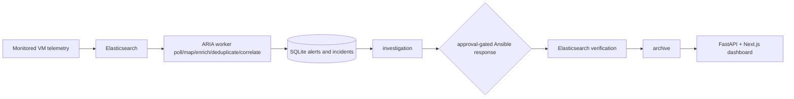
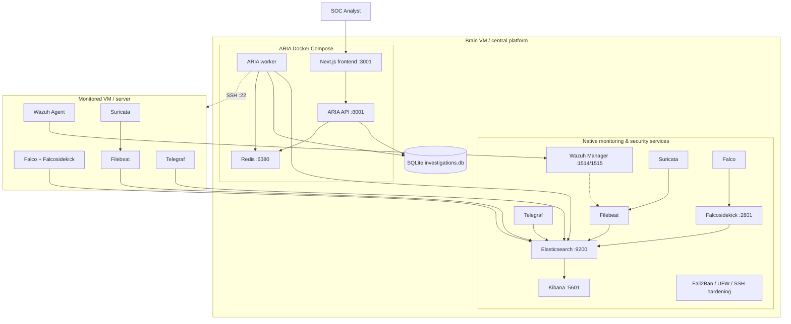
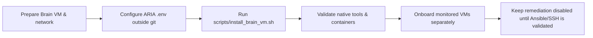

# ARIA — AI-assisted Security Orchestration, Automation and Response

ARIA is a **local-first SOC/SOAR platform** that turns security telemetry into actionable, approval-gated response. Built for SOC analysts, administrators, and security operators, it delivers telemetry visibility, alert correlation, AI-assisted investigation, and controlled Ansible remediation without requiring an upstream SaaS.

> **Scope note:** This repository contains the ARIA application, the native central monitoring/security tool installer, Ansible-assisted monitored-VM onboarding, and a final-year project report. It does **not** include cloud provisioning, high availability, a production reverse proxy/TLS stack, or a fully tested disaster-recovery workflow.

## What ARIA does

ARIA consumes telemetry already flowing into Elasticsearch, normalizes and enriches it, correlates related signals into incidents, investigates them with optional AI assistance, and can execute Ansible remediation only after explicit approval. Resolved cases are verified against Elasticsearch and archived.

### End-to-end worker-driven flow



*Confirmed from current source.*

## Architecture at a glance



*Confirmed from current source. `Front_end + back_end/` and `Aria_Tools_SetUp/` are legacy local folder names only; the canonical repository layout uses `aria-application/` and `aria-tools-setup/`.*

## Deployment roles

| Role | What it hosts | What it does not host |
|---|---|---|
| **Brain VM / central platform** | Elasticsearch, Kibana, Wazuh Manager, Filebeat, Suricata, Falco/Falcosidekick, Telegraf, detection rules, host hardening; plus the ARIA Compose stack (Redis, API, worker, frontend). | Monitored endpoints' agents or duplicated ARIA worker logic. |
| **Monitored VM / server** | Wazuh Agent, Filebeat, Suricata, Falco/Falcosidekick, Telegraf. Sends telemetry to the Brain VM. | ARIA API, ARIA worker, Redis, SQLite, Kibana, Elasticsearch, Wazuh Manager. |
| **Native monitoring/security services** | Central systemd services installed by `aria-tools-setup/tools/setup_script_telegraf.sh`. | These are not Docker Compose services. |
| **ARIA Compose containers** | `redis`, `api`, `worker`, `frontend` from `aria-application/docker-compose.yml`. | These do not replace Elasticsearch, Wazuh Manager, Kibana, etc. |

## Repository map

```text
aria-application/          ARIA FastAPI backend, worker, Next.js frontend, Docker Compose
aria-tools-setup/          Native Brain VM monitoring/security tool installer scripts
ansible-vm-setup/          Ansible wrapper for monitored-VM onboarding (sanitize before use)
docker-compose/            Duplicate Compose reference (not the primary authority)
aria-report/               Final-year project report and historical diagrams (reference only)
docs/                      Authoritative documentation
scripts/                   Operational wrappers, including install_brain_vm.sh
```

## Safe deployment order



## Documentation

- [Architecture](docs/architecture/ARIA_ARCHITECTURE.md) — current component placement, data flow, and Mermaid diagrams
- [Brain VM setup](docs/deployment/BRAIN_VM_SETUP.md) — exact central deployment guide
- [Monitored VM onboarding](docs/deployment/MONITORED_VM_ONBOARDING.md) — agent onboarding boundaries
- [Validation and troubleshooting](docs/operations/VALIDATION_AND_TROUBLESHOOTING.md) — safe operational checks
- [Security and secrets](docs/operations/SECURITY_AND_SECRETS.md) — secret handling and current limitations
- [Backup and decommission limitations](docs/operations/BACKUP_AND_DECOMMISSION_LIMITATIONS.md) — what recovery exists and what does not

## ⚠️ Safety warnings

- The central setup scripts in `aria-tools-setup/tools/` may **install, purge, reconfigure, start, stop, or harden services** on the host they run on. They must only be executed on the intended Brain VM and only after review.
- Secrets — including `.env`, passwords, tokens, private keys, live inventories, and runtime evidence — must **never be committed** to this repository.
- The Ansible material in `ansible-vm-setup/` and historical repository content contain plaintext credentials and must be sanitized and rotated before production use.

## Confirmed limitations

- **Single central platform model** — one Brain VM with local Elasticsearch; no clustering or high availability.
- **SQLite workflow state** — operational state lives in a local SQLite database inside the ARIA data directory.
- **Published Docker images** — the current Compose file uses mutable `latest` image tags from Docker Hub.
- **Backup/recovery incomplete** — full-stack, off-host, or disaster-recovery procedures are not proven.
- **Production hardening required** — TLS termination, exposure boundaries, authorization coverage, SSH host-key verification, and secrets handling need review before production use.
- **No Kafka, active Neo4j, Kubernetes, Terraform, SSO, or automated cloud provisioning** in the currently implemented flow.

## Historical/reference material

The final-year report under [`aria-report/`](aria-report/) and the presentation material provide project background and demonstrated-topology evidence. They should be treated as **historical/reference material** and not as a live operations contract; current source code overrides them where they conflict.
