<!-- ░░░░░░░░░░░░░░░░░░░░░░░░░░░░░░░░░░░░░░░░░░░░░░░░░░░░░░░░░░░░░░░░░░░░░ -->
<div align="center">


<h3>The local-first SOC / SOAR platform that <em>investigates</em> and <em>responds</em> — not just alerts.</h3>

<p>
ARIA turns the security telemetry you already collect into <b>correlated incidents</b>, <b>AI-driven investigations</b>, and <b>approval-gated Ansible remediation</b> — then verifies the fix against Elasticsearch and archives the case. No upstream SaaS required.
</p>

<p>


<br/>


</p>

<p>


</p>

<p><sub>Final-year engineering project (PFE) — <b>ESPRIT</b> × <b>Huawei</b> · 2025–2026 · by Ghazi Mabrouki</sub></p>

</div>

<!-- ░░░░░░░░░░░░░░░░░░░░░░░░░ HERO ░░░░░░░░░░░░░░░░░░░░░░░░░ -->
<div align="center">

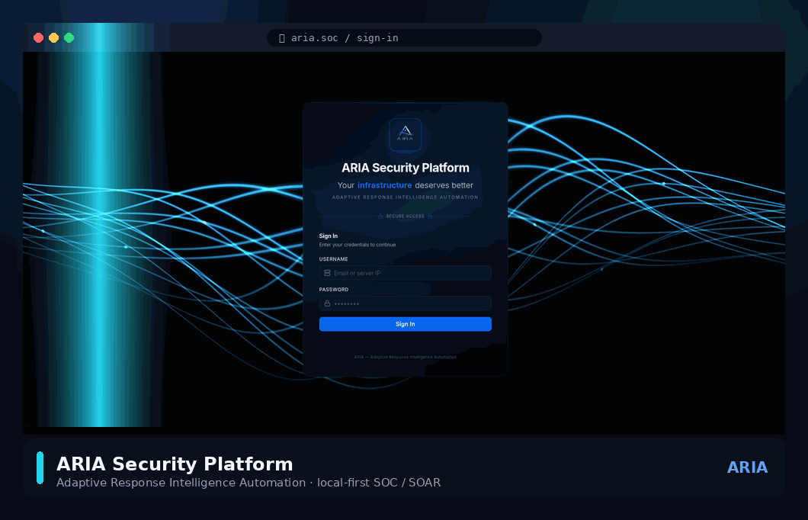

<sub><i>Sign-in → live SOC dashboard → incident correlation → autonomous AI investigation → approval-gated, ES-verified response.</i></sub>

</div>

---

## 🧭 Why ARIA exists

Most SOC stacks stop at **detection** — they hand an analyst a wall of alerts and walk away. ARIA closes the loop:

> **Telemetry → Incident → Investigation → *Approved Action* → Verification → Archive.**

It reads the telemetry already flowing into Elasticsearch (Wazuh, Suricata, Falco, Telegraf), **normalizes and enriches** it, **correlates** related signals into incidents, **investigates** them with an LLM, proposes a **staged Ansible playbook**, executes **only after a human approves**, then **re-queries Elasticsearch to prove the threat is gone** before archiving the case with full evidence.

Everything runs on a single **Brain VM** you control. The LLM can be a local **Ollama** model — your data never has to leave the box.

---

## 🌊 The detection-to-response pipeline

<div align="center">
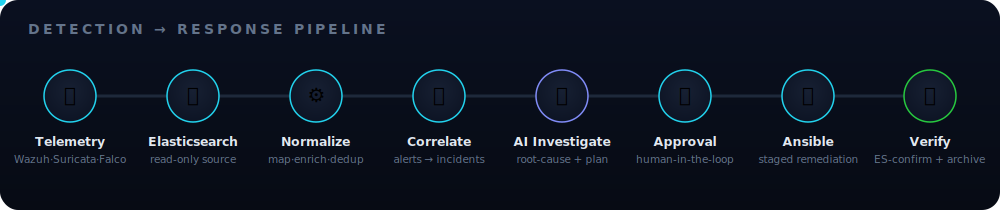
</div>

<table>
<tr>
<td width="33%" valign="top">

**① Ingest & normalize**
Worker polls Elasticsearch, maps each source (Wazuh / Suricata / Falco / Filebeat / generic) into one canonical alert schema, normalizes severity, extracts IOCs.

</td>
<td width="33%" valign="top">

**② Enrich & de-noise**
GeoIP, MITRE ATT&CK, threat-intel and campaign tagging; **3-tier dedup** (Redis → memory → SQLite) and **Sigma** noise filtering keep the signal clean.

</td>
<td width="33%" valign="top">

**③ Correlate**
A 7-level correlation hierarchy groups alerts into **incidents**, tracks kill-chain phase, and links Suricata ↔ Wazuh views of the same event.

</td>
</tr>
<tr>
<td valign="top">

**④ Investigate (AI)**
Evidence collection → LLM root-cause → a **staged remediation plan** (evidence · dry-run · containment · hardening · forensics · verification). A deterministic path exists when you'd rather not trust the model.

</td>
<td valign="top">

**⑤ Respond (gated)**
Nothing executes without **explicit approval**, protected by an admin secret. Ansible runs in stages with **dry-run**, firewall safety and **rollback** built in.

</td>
<td valign="top">

**⑥ Verify & archive**
A delayed Elasticsearch recurrence query plus active state checks decide the **fix status**. The case — evidence, playbook, AI analysis — is archived and exportable to **PDF**.

</td>
</tr>
</table>

---

## 🤖 The signature feature: an auditable investigation state machine

Every case — security, infrastructure, or runtime — walks the **same eight-step workflow**. No black box: each step shows its evidence, its command output, and its exit code.

<div align="center">
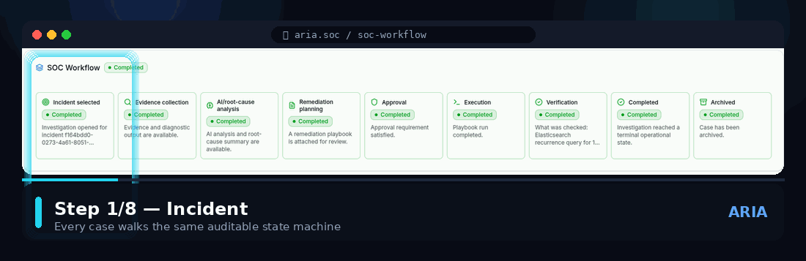
</div>

```
 Incident ─▶ Evidence ─▶ AI Root-Cause ─▶ Remediation Plan ─▶ Approval ─▶ Ansible ─▶ Verification ─▶ Archived
   sel.        collect      LLM analysis      staged playbook    human       staged       ES re-query     evidence
                                                                 gate        exec         + state         + PDF
```

---

## 🛰️ One platform, many lenses

<div align="center">
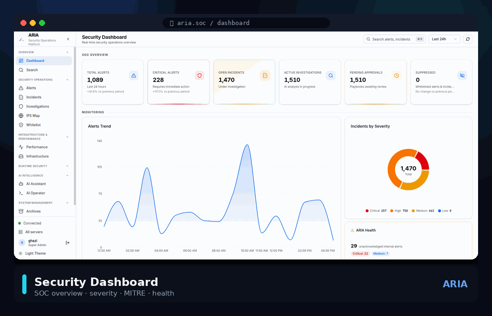
</div>

<table>
<tr>
<th>🛡️ Security Operations</th>
<th>📈 Infrastructure & Performance</th>
<th>🧬 Runtime Security</th>
</tr>
<tr>
<td valign="top">

- Real-time **SOC dashboard** (severity, MITRE, trends, health)
- **Alerts** with IOC extraction & related-incident pivots
- **Incident** correlation & one-click *Investigate*
- **IPS Map** — live attack paths on a world map
- **Whitelist** management (IP / subnet / domain)

</td>
<td valign="top">

- **Performance** — live CPU / memory / disk / network from Telegraf
- **Top processes** by CPU & memory, per host
- **Infrastructure anomalies** auto-diagnosed by AI
- Resource gauges, thresholds & root-cause cards

</td>
<td valign="top">

- **Falco**-driven host & container behavior analysis
- Process / file / privilege-escalation classification
- Threat classification with confidence + decision routing
- Diagnostics-only by default; remediation behind approval

</td>
</tr>
<tr>
<th>🧠 AI Intelligence</th>
<th>🌐 Multi-server</th>
<th>📦 System Management</th>
</tr>
<tr>
<td valign="top">

- **AI Assistant** — context-aware chat across the whole estate
- **AI Operator** — natural language → Ansible, with confirmation
- Pluggable LLM: **Ollama**, Gemini, OpenRouter, NVIDIA NIM
- Deterministic bypass for trust-critical actions

</td>
<td valign="top">

- **Monitored assets** with per-asset scoping
- Roles: **super_admin** & **server_user**
- Per-asset index patterns & credentials
- Onboard a new VM with a single bootstrap script

</td>
<td valign="top">

- **Archives** with verified fix status & **PDF** export
- Full **audit log** of every state change
- **Settings center** (data sources, AI, workflow, Ansible…)
- WebSocket-driven live updates everywhere

</td>
</tr>
</table>

<details>
<summary><b>📸 Click to expand the full screenshot gallery</b></summary>

<br/>

| Sign-in | Security Dashboard |
|:--:|:--:|
| 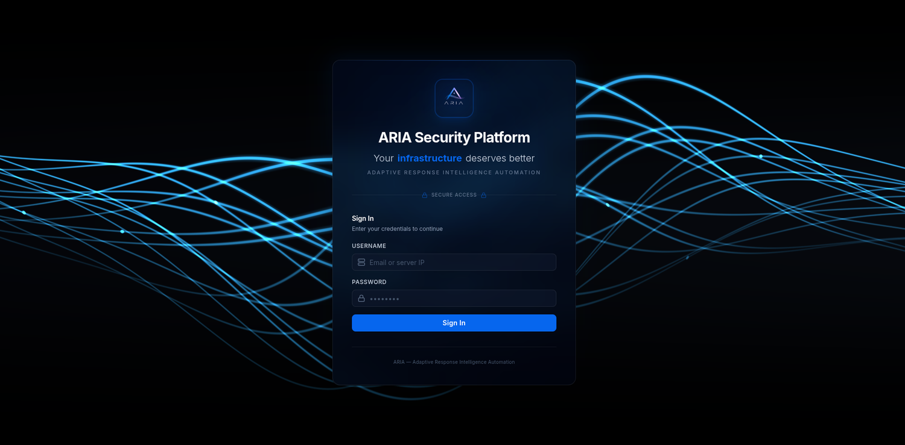 | 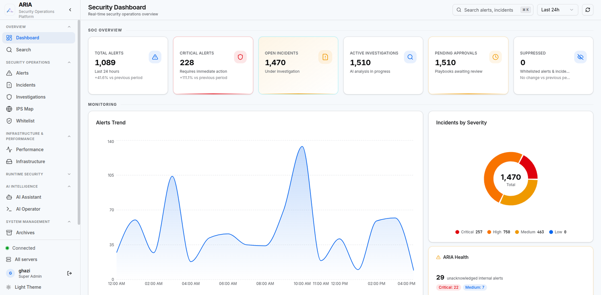 |

| Incident Correlation | AI Investigation (live) |
|:--:|:--:|
| 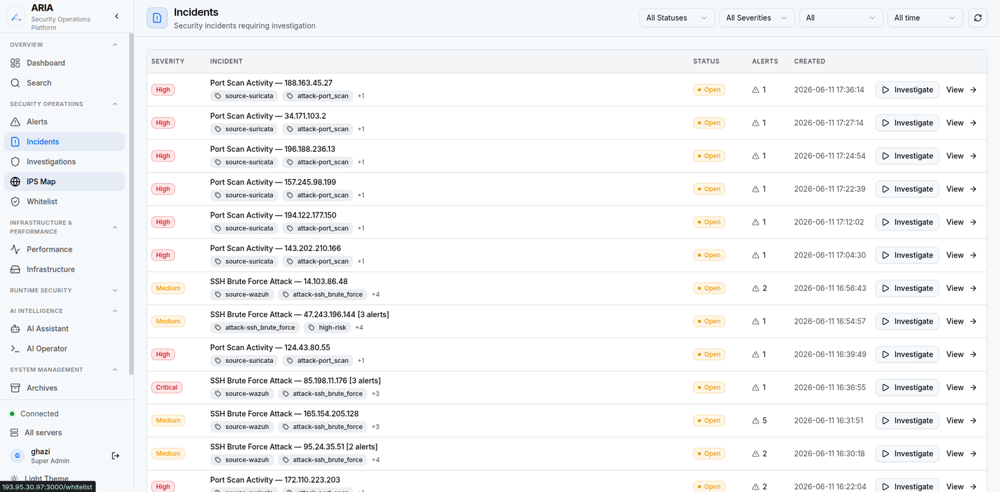 | 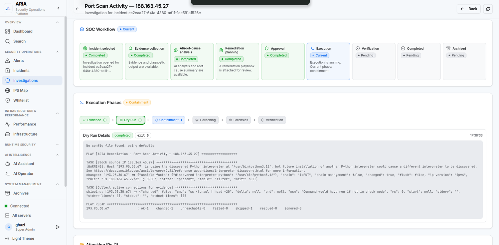 |

| Auditable SOC Workflow | AI Security Assistant |
|:--:|:--:|
| 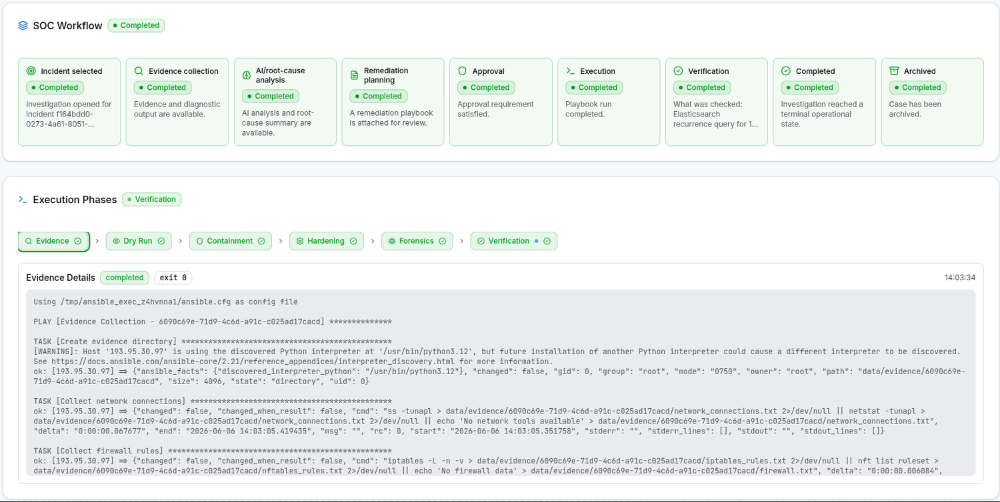 | 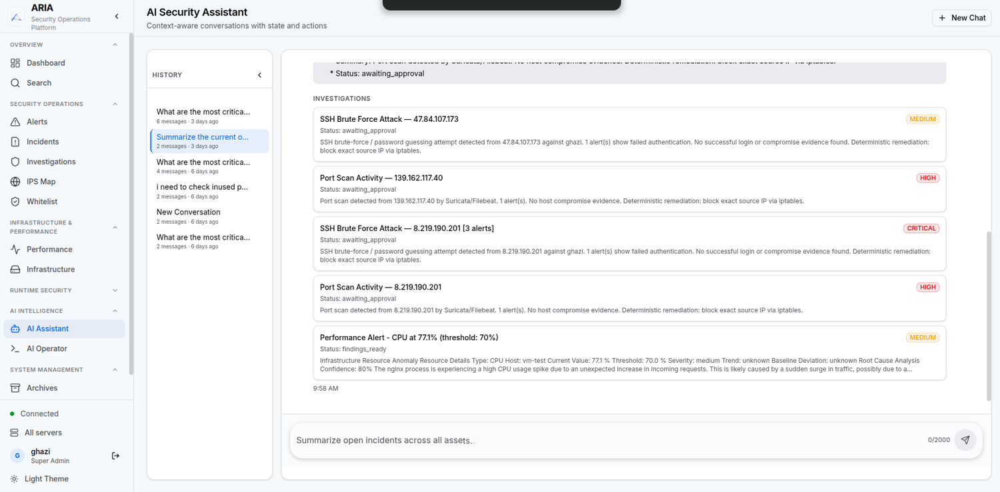 |

| Performance Monitoring | Infrastructure Anomaly |
|:--:|:--:|
| 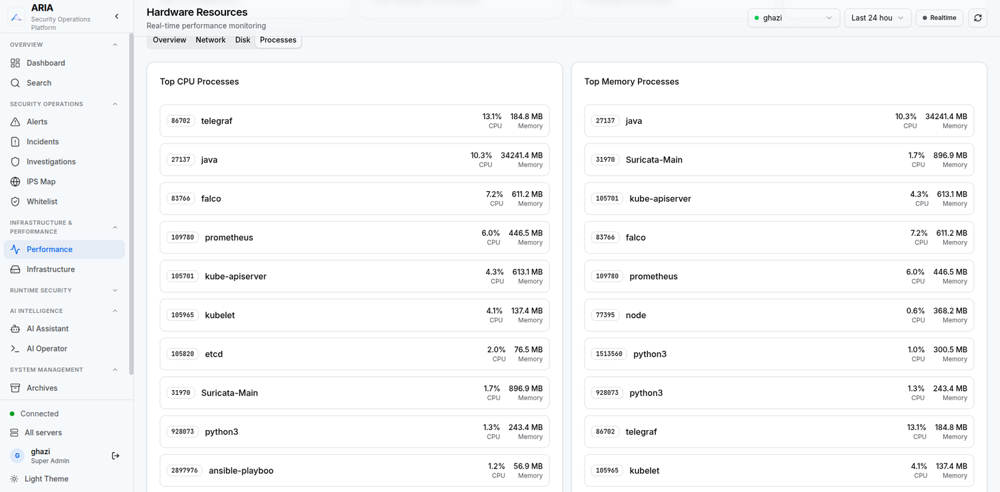 | 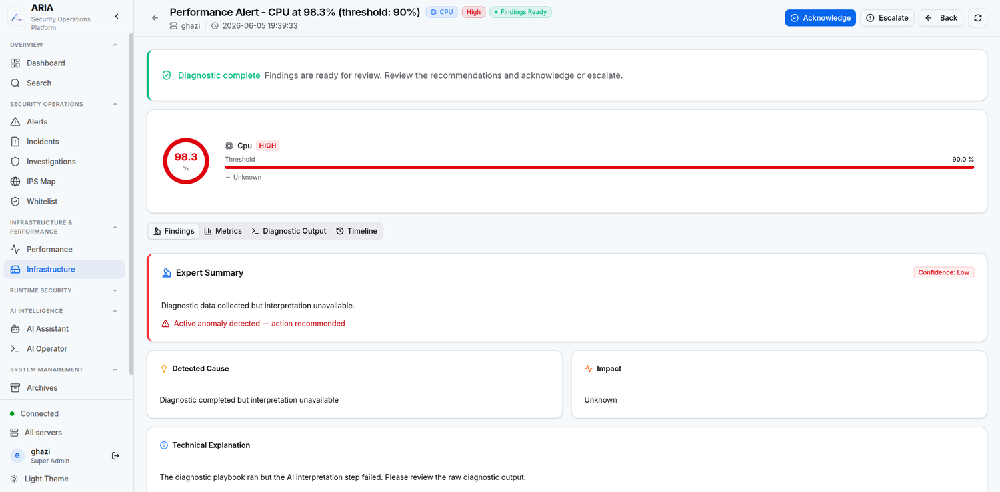 |

| Verified Archive (PDF-exportable) | |
|:--:|:--:|
| 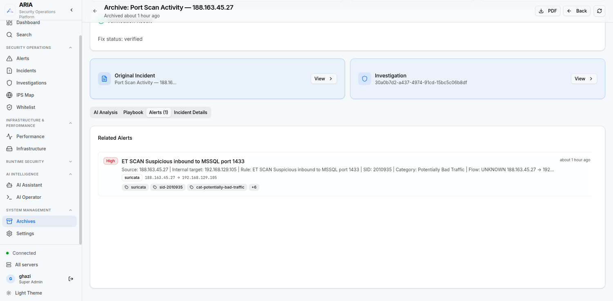 | |

</details>

---

## 🏗️ Architecture at a glance


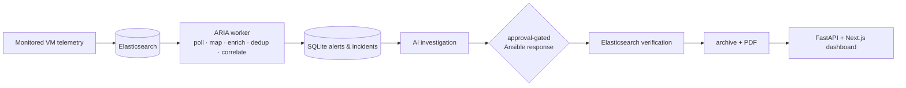

*Confirmed from current source.*

---

## 🧱 Tech stack

| Layer | Technology |
|---|---|
| **Backend** | Python 3.12 · FastAPI · async SQLAlchemy 2.0 + aiosqlite · async Redis · httpx |
| **State** | SQLite (WAL + FTS5) — `data/investigations.db` · hand-rolled migrations |
| **Frontend** | Next.js 16 (App Router) · React · SWR · WebSocket · shadcn/ui · Tailwind |
| **Detection** | Wazuh · Suricata · Falco / Falcosidekick · Filebeat · Telegraf |
| **Source of truth** | Elasticsearch (read-only) + Kibana |
| **Response** | Ansible (staged, dry-run, rollback) via subprocess |
| **AI / LLM** | Ollama (local default) · Google Gemini · OpenRouter · NVIDIA NIM — `provider=auto` |
| **Auth** | JWT (python-jose) · bcrypt (passlib) · admin-secret gating |
| **Packaging** | Docker Compose (redis · api · worker · frontend) · reportlab (PDF) |

---

## 🚀 Deployment roles

| Role | Hosts | Does **not** host |
|---|---|---|
| **Brain VM / central platform** | Elasticsearch, Kibana, Wazuh Manager, Filebeat, Suricata, Falco/Falcosidekick, Telegraf, host hardening **+** the ARIA Compose stack (Redis, API, worker, frontend). | Monitored endpoints' agents or duplicated worker logic. |
| **Monitored VM / server** | Wazuh Agent, Filebeat, Suricata, Falco/Falcosidekick, Telegraf — sends telemetry to the Brain VM. | ARIA API, worker, Redis, SQLite, Kibana, Elasticsearch, Wazuh Manager. |
| **Native services** | Installed by `aria-tools-setup/tools/setup_script_telegraf.sh` (systemd). | These are not Docker Compose services. |
| **ARIA Compose** | `redis`, `api`, `worker`, `frontend` from `aria-application/docker-compose.yml`. | These do not replace Elasticsearch/Wazuh/Kibana. |

### Safe deployment order

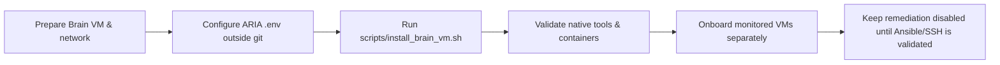

---

## 🗂️ Repository map

```text
aria-application/    ARIA FastAPI backend, worker, Next.js frontend, Docker Compose
aria-tools-setup/    Native Brain VM monitoring/security tool installer scripts
ansible-vm-setup/    Ansible wrapper for monitored-VM onboarding (sanitize before use)
docker-compose/      Duplicate Compose reference (not the primary authority)
aria-report/         Final-year project report and historical diagrams (reference only)
docs/                Authoritative documentation
scripts/             Operational wrappers, including install_brain_vm.sh
assets/              README media (generated GIFs, animated SVGs, screenshots)
```

---

## 📚 Documentation

- [Architecture](docs/architecture/ARIA_ARCHITECTURE.md) — component placement, data flow, diagrams
- [Brain VM setup](docs/deployment/BRAIN_VM_SETUP.md) — exact central deployment guide
- [Monitored VM onboarding](docs/deployment/MONITORED_VM_ONBOARDING.md) — agent onboarding boundaries
- [Validation & troubleshooting](docs/operations/VALIDATION_AND_TROUBLESHOOTING.md) — safe operational checks
- [Security & secrets](docs/operations/SECURITY_AND_SECRETS.md) — secret handling and current limitations
- [Backup & decommission limitations](docs/operations/BACKUP_AND_DECOMMISSION_LIMITATIONS.md) — what recovery exists and what does not

---

## ⚠️ Safety warnings

- The central setup scripts in `aria-tools-setup/tools/` may **install, purge, reconfigure, start, stop, or harden services** on the host they run on. Run them only on the intended Brain VM, only after review.
- Secrets — `.env`, passwords, tokens, private keys, live inventories, runtime evidence — must **never be committed**.
- The Ansible material in `ansible-vm-setup/` and historical content contains plaintext credentials and must be **sanitized and rotated** before production use.

## 🚧 Confirmed limitations

- **Single central platform** — one Brain VM with local Elasticsearch; no clustering or HA.
- **SQLite workflow state** — operational state lives in a local SQLite database.
- **Published Docker images** — Compose uses mutable `latest` tags.
- **Backup/recovery incomplete** — full-stack, off-host, or DR procedures are not proven.
- **Production hardening required** — TLS termination, exposure boundaries, authorization coverage, SSH host-key verification, and secrets handling need review before production.
- **Not implemented** — Kafka, active Neo4j, Kubernetes, Terraform, SSO, automated cloud provisioning.

---

## 🎓 Project context

ARIA is a final-year engineering graduation project (**PFE**) developed at **ESPRIT** in partnership with **Huawei** (academic year 2025–2026) by **Ghazi Mabrouki**. The full report and presentation material live under [`aria-report/`](aria-report/) and should be treated as **historical/reference** material — current source code overrides it where they conflict.

<div align="center">
<br/>
<sub>Built for analysts who want their tools to <b>act</b>, not just alert. ⚡</sub>
</div>
