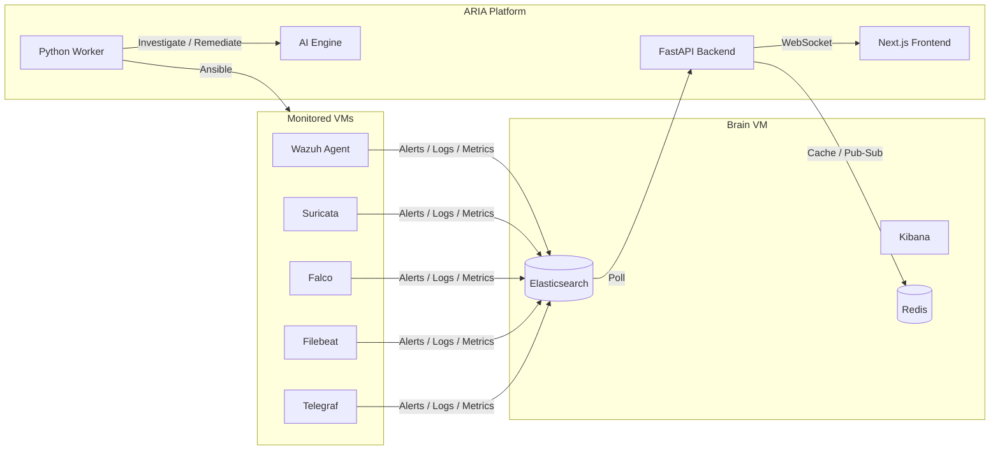

# ARIA — Adaptive Response Intelligence Automation

> **Intelligent Platform for Automated Monitoring and Security**

[](https://hub.docker.com/r/ghaziiii/aria_project)
[](http://localhost:8001/docs)
[](http://localhost:3001)
[](redis://localhost:6380)

ARIA is a security operations (SOC / SOAR) automation platform that ingests alerts from heterogeneous sources (Wazuh, Suricata, Falco, Filebeat, Telegraf), correlates them into incidents, enriches them with GeoIP and MITRE ATT&CK context, and applies an AI-assisted *Response Intelligence Layer* to investigate, generate Ansible remediation playbooks, manage human or auto-approval workflows, execute fixes, verify them, and archive cases.

This repository consolidates the complete ARIA engineering artifact:

- The main application source code (Next.js dashboard + FastAPI backend)
- Infrastructure setup scripts for the central brain VM
- Ansible automation for onboarding monitored VMs
- Production Docker Compose deployment (pre-built images)
- The final internship report (LaTeX source + PDF)

---

## Table of Contents

1. [Project Overview](#project-overview)
2. [Repository Structure](#repository-structure)
3. [System Architecture](#system-architecture)
4. [Quick Start with Docker Compose](#quick-start-with-docker-compose)
5. [Manual Deployment](#manual-deployment)
   - [1. Provision the Brain VM](#1-provision-the-brain-vm)
   - [2. Onboard Monitored VMs](#2-onboard-monitored-vms)
   - [3. Run the ARIA Application](#3-run-the-aria-application)
6. [Configuration](#configuration)
7. [Feature Overview](#feature-overview)
8. [Development](#development)
9. [Testing](#testing)
10. [Network & Ports](#network--ports)
11. [Validation & Report](#validation--report)
12. [Authors & Acknowledgments](#authors--acknowledgments)

---

## Project Overview

Modern information systems are distributed across servers, networks, containers, cloud resources, and security tools. Each layer produces logs, metrics, and alerts. A SOC's operational challenge is to transform this flood of raw signals into a small number of well-understood, prioritized, and actionable incidents.

ARIA addresses this challenge by adding an orchestration, intelligence, and controlled automation layer on top of existing monitoring tools:

```text
Security tools  ->  Elasticsearch  ->  ARIA Backend  ->  ARIA Frontend
```

### Core Objectives

- **Multi-source alert pipeline**: Poll Elasticsearch and normalize alerts from Wazuh, Suricata, Falco, Filebeat, and Telegraf.
- **Enrichment & correlation**: GeoIP, MITRE ATT&CK mapping, Sigma noise filtering, deduplication, and incident grouping.
- **AI-assisted response**: Investigation summaries, risk assessments, narratives, and Ansible playbook generation.
- **Controlled remediation**: Approval gates, execution, verification, archiving, audit, and safety mechanisms.
- **Operational dashboard**: FastAPI backend + Next.js frontend for SOC analysts and administrators.
- **Validation evidence**: Automated tests, build checks, API checks, and runtime verification reports.

---

## Repository Structure

```text
Aria-Project/
├── aria-application/          # Full ARIA platform (Next.js 16 + FastAPI)
│   ├── api/                   # FastAPI app, routes, WebSocket manager
│   ├── frontend/              # Next.js dashboard (App Router)
│   ├── pipeline/              # Alert ingestion, mappers, enrichment, forwarding
│   ├── response/              # AI engine, watcher, approval, Ansible execution
│   ├── core/                  # Elasticsearch, Redis, GeoIP clients
│   ├── config/                # Pydantic settings + Sigma rules
│   ├── data/                  # Runtime state (empty, populated at runtime)
│   ├── tests/                 # pytest unit + e2e tests
│   ├── docker-compose.yml     # Standalone production compose
│   └── AGENTS.md              # Coding-agent guide
├── aria-tools-setup/          # Main brain VM setup scripts
│   ├── tools/                 # Elasticsearch, Wazuh, Suricata, Falco, Telegraf setup
│   └── Script that i should inject in VMs to monitor them/
│       └── bootstrap_monitored_vm.sh
├── ansible-vm-setup/          # Ansible playbook for monitored VM onboarding
│   ├── playbook.yml
│   ├── bootstrap_monitored_vm.sh
│   ├── inventory.ini
│   └── ansible.cfg
├── docker-compose/            # Production Docker Compose (pre-built images)
│   └── docker-compose.yml
└── aria-report/               # LaTeX internship report + main.pdf
    ├── main.tex
    ├── main.pdf
    ├── chapters/
    ├── appendices/
    └── assets/
```

---

## System Architecture

### High-Level Data Flow



### Backend Components

| Module | Responsibility |
|--------|----------------|
| `api/` | FastAPI HTTP/WebSocket server, REST endpoints, dashboard API |
| `pipeline/` | Elasticsearch polling, source mappers, enrichment, deduplication, forwarding |
| `response/` | AI investigation engine, approval workflow, Ansible execution, fix verification, archiving |
| `core/` | Elasticsearch, Redis, GeoIP clients |
| `config/` | Pydantic settings, environment loading, Sigma rules |

### Frontend Components

| Module | Responsibility |
|--------|----------------|
| `app/(dashboard)/` | Dashboard routes: alerts, incidents, investigations, archives, monitoring, settings |
| `components/ui/` | shadcn/ui component library (Radix UI + Tailwind CSS) |
| `lib/api.ts` | Typed API client for backend communication |
| `lib/websocket.tsx` | WebSocket provider for real-time updates |

---

## Quick Start with Docker Compose

The fastest way to run ARIA is with the pre-built images published to Docker Hub.

### Prerequisites

- Docker + Docker Compose
- A running Elasticsearch instance (the reference deployment uses `193.95.30.97:9200`)
- An LLM endpoint (Ollama or NVIDIA NIM) reachable from the containers

### 1. Clone and enter the deployment folder

```bash
git clone git@github.com:Ghazimabrouki/Aria-Project.git
cd Aria-Project/docker-compose
```

### 2. Create your environment file

```bash
cp ../aria-application/.env.example .env   # or create from scratch
```

The minimal `.env` needs:

```dotenv
# Backend
BACKEND_PORT=8001
BACKEND_URL=http://localhost:8001
SECRET_KEY=change-me-in-production

# Redis (container name resolved inside compose)
REDIS_HOST=redis
REDIS_PORT=6379

# Elasticsearch
ELASTICSEARCH_URL=https://193.95.30.97:9200
ELASTICSEARCH_USER=elastic
ELASTICSEARCH_PASSWORD=your-es-password
ELASTICSEARCH_USE_SSL=false

# AI / LLM
LLM_PROVIDER=ollama
OLLAMA_HOST=http://193.95.30.97:11434
OLLAMA_TIMEOUT=120
LLM_MODEL=llama3.2
LLM_ENABLED=true

# Ansible (target host for remediation)
ANSIBLE_ENABLED=true
ANSIBLE_REMOTE_HOST=your-vm-ip
ANSIBLE_REMOTE_USER=your-user
ANSIBLE_SSH_KEY=/app/data/your-key.pem
# or
# ANSIBLE_SSH_PASSWORD=your-password

# Notifications (optional)
SLACK_WEBHOOK_URL=
SMTP_HOST=
```

> **Security note:** Never commit `.env` files. They are excluded by `.gitignore`.

### 3. Start the stack

```bash
docker compose up -d
```

Services:

| Service | Container | External Port | Image |
|---------|-----------|---------------|-------|
| Redis | `aria-redis` | `6380` | `ghaziiii/aria_project:redis-latest` |
| API | `aria-api` | `8001` | `ghaziiii/aria_project:backend-latest` |
| Worker | `aria-worker` | — | `ghaziiii/aria_project:worker-latest` |
| Frontend | `aria-frontend` | `3001` | `ghaziiii/aria_project:frontend-latest` |

### 4. Open the dashboard

- **Dashboard:** http://localhost:3001
- **API docs:** http://localhost:8001/docs
- **Redis:** `redis-cli -p 6380 ping`

### 5. View logs

```bash
docker compose logs -f api
docker compose logs -f worker
docker compose logs -f frontend
```

### 6. Stop

```bash
docker compose down
```

To remove persisted data as well:

```bash
docker compose down -v
```

---

## Manual Deployment

### 1. Provision the Brain VM

The *brain VM* hosts Elasticsearch, Kibana, Wazuh, Suricata, Falco, Filebeat, Telegraf, and Redis. Use the scripts in `aria-tools-setup/tools/`.

```bash
cd aria-tools-setup/tools

# 1. Elasticsearch + Kibana + Filebeat
sudo bash siem_setup.sh

# 2. Wazuh manager
sudo bash wazuh_setup.sh

# 3. Suricata network IDS
sudo bash suricata_setup.sh

# 4. Falco runtime security
sudo bash setup-falco-server-elastic.sh

# 5. Telegraf metrics
sudo bash telegraf_setup.sh

# 6. System hardening + detection rules
sudo bash hardening_setup.sh
sudo bash detection_rules_setup.sh
```

Each script is interactive and idempotent where possible. The full setup is detailed in the [report](aria-report/main.pdf).

### 2. Onboard Monitored VMs

Monitored VMs send their telemetry (logs, metrics, security events) to the brain VM. Use either the standalone bootstrap script or the Ansible playbook.

#### Option A — Standalone bootstrap script

```bash
# On the monitored VM
sudo bash aria-tools-setup/Script\ that\ i\ should\ inject\ in\ VMs\ to\ monitor\ them/bootstrap_monitored_vm.sh \
  --yes \
  --vm-name web-01 \
  --environment safe \
  --es-ip 193.95.30.97 \
  --es-user elastic \
  --wazuh-group default
```

#### Option B — Ansible playbook

```bash
cd ansible-vm-setup

# Edit inventory.ini with your monitored VMs
# [monitored_vms]
# 10.0.0.5 ansible_user=ubuntu ansible_ssh_private_key_file=~/.ssh/id_rsa

# Edit playbook.yml variables (ES credentials, Wazuh group, etc.)

ansible-playbook -i inventory.ini playbook.yml
```

The playbook:

1. Stops `unattended-upgrades` to prevent apt locks.
2. Cleans and repairs apt/dpkg state.
3. Copies `bootstrap_monitored_vm.sh` to the target.
4. Executes it with the configured arguments.
5. Reports success/failure.

### 3. Run the ARIA Application

#### Backend

```bash
cd aria-application

# Optional: create/activate a virtual environment
python3 -m venv .venv
source .venv/bin/activate

# Install dependencies (manage manually; no requirements.txt/pyproject.toml is provided)
pip install fastapi uvicorn sqlalchemy aiosqlite redis elasticsearch httpx structlog pydantic-settings

# Start API server
python3 -m uvicorn api.app:app --host 0.0.0.0 --port 8001
```

#### Background worker

```bash
# In another terminal / process
python3 main.py
```

The worker runs all background tasks: alert polling, incident watcher, correlation, retry queue, performance monitoring, backups, and the settings-reload listener.

#### Frontend

```bash
cd aria-application/frontend

# Install dependencies
pnpm install

# Development server
pnpm dev

# Production build
pnpm build
pnpm start
```

---

## Configuration

All backend configuration is driven by `aria-application/config/settings.py` (Pydantic `BaseSettings`) and loaded from `.env` at runtime.

### Key Configuration Categories

| Category | Variables |
|----------|-----------|
| **Elasticsearch** | `ELASTICSEARCH_URL`, `ELASTICSEARCH_USER`, `ELASTICSEARCH_PASSWORD`, `ELASTICSEARCH_USE_SSL` |
| **Redis** | `REDIS_HOST`, `REDIS_PORT` |
| **LLM / AI** | `LLM_PROVIDER`, `LLM_MODEL`, `OLLAMA_HOST`, `NVIDIA_API_KEY`, `LLM_ENABLED`, `LLM_FALLBACK_TO_PYRCA` |
| **Ansible** | `ANSIBLE_ENABLED`, `ANSIBLE_REMOTE_HOST`, `ANSIBLE_REMOTE_USER`, `ANSIBLE_SSH_KEY`, `ANSIBLE_SSH_PASSWORD`, `ANSIBLE_BECOME_METHOD`, `ANSIBLE_BECOME_PASSWORD` |
| **Auto-approval** | `AUTO_APPROVE_ENABLED`, `AUTO_APPROVE_METHOD`, `AUTO_APPROVE_SEVERITIES`, `AUTO_APPROVE_BLOCK_SEVERITIES` |
| **Monitoring** | `PERFORMANCE_ENABLED`, `PERFORMANCE_POLL_INTERVAL`, `PERFORMANCE_CPU_*`, `PERFORMANCE_MEMORY_*` |
| **Notifications** | `SLACK_WEBHOOK_URL`, `SMTP_HOST`, `SMTP_PORT`, `SMTP_USER`, `SMTP_PASSWORD` |
| **Paths** | `DB_PATH`, `CURSOR_DIR`, `SEEN_IDS_DIR`, `PLAYBOOK_DIR`, `BACKUP_DIR` |

### Runtime Settings Reload

Most settings can be changed from the dashboard **without restarting** the backend or worker:

1. Go to **Settings** in the dashboard.
2. Update a section (Data Sources, Redis, AI, Ansible, Workflow, Pipeline, Monitoring, Assets).
3. Click **Save**.
4. Changes are written to `.env`, propagated through Redis pub/sub, and reloaded by the running worker.

Only these settings still require a restart: `BACKEND_PORT`, `API_HOST`, `CORS_ORIGINS`, `DB_PATH`.

---

## Feature Overview

### Alert Pipeline

- Polls Elasticsearch at a configurable interval.
- Source-specific mappers for Wazuh, Suricata, Falco, Filebeat, and generic documents.
- Deduplication via Redis-backed seen-IDs.
- GeoIP enrichment and MITRE ATT&CK technique mapping.
- Sigma noise filtering.

### Incidents & Correlation

- Correlates related alerts into incidents.
- Groups by source, target host, technique, and temporal proximity.
- Local-only mode keeps everything in SQLite; upstream mode can forward to a central OpenSOAR instance.

### AI Investigation Engine

- Generates investigation summaries, risk scores, and narratives.
- Proposes Ansible remediation playbooks.
- Supports multiple LLM providers: NVIDIA NIM, Ollama, OpenAI, Anthropic, Google, OpenRouter, with rule-based fallback.

### Approval & Remediation

- Human-in-the-loop approval for remediation playbooks.
- Configurable auto-approval (`static`, `dynamic`, `ai`, `hybrid`).
- Ansible playbook execution with credentials scoped per asset.
- Post-fix verification by re-querying Elasticsearch.
- Case archiving with full audit trail.

### Dashboard

- Real-time alerts, incidents, investigations, archives.
- Search across alerts and incidents.
- Performance monitoring charts.
- Asset management with per-asset Ansible credentials.
- Settings pages with runtime reload.
- IP intelligence and GeoIP maps.

### Monitoring & Operations

- Optional Telegraf/CPU/memory/process monitoring.
- Redis-backed rate limiting and caching.
- Structured logging with `structlog`.
- Daily SQLite + state backups.
- systemd service example for production.

---

## Development

### Backend

```bash
cd aria-application
pytest tests/ -v
```

### Frontend

```bash
cd aria-application/frontend
pnpm lint
pnpm build
```

### Code Style

- Backend: Python 3.12+, fully async (`async`/`await`), `structlog` for logging.
- Frontend: Next.js 16 App Router, TypeScript 5.7, Tailwind CSS v4, shadcn/ui.
- See `aria-application/AGENTS.md` for full coding conventions.

---

## Testing

- **Unit tests:** `pytest tests/ -v`
- **E2E tests:** `./run_e2e_tests.sh all` (requires external Elasticsearch + Ollama at `193.95.30.97`)
- **Docker smoke test:** login, dashboard, alerts, incidents, investigations, archives, settings save, Ansible connection, ES/Redis/AI tests.

> E2E tests assume specific remote IPs. Update `tests/e2e/conftest.py` URLs before running in a different environment.

---

## Network & Ports

| Port | Service | Description |
|------|---------|-------------|
| `3001` | Next.js frontend | Operator dashboard |
| `8001` | FastAPI backend | REST API + WebSocket |
| `6380` | Redis | Cache, dedup, pub-sub |
| `9200` | Elasticsearch | Alert/log index (brain VM) |
| `5601` | Kibana | Search & visualization |
| `1514/1515` | Wazuh | Agent registration / syslog |
| `11434` | Ollama | Local LLM endpoint |

---

## Validation & Report

The complete internship report is available in `aria-report/`:

```text
aria-report/
├── main.pdf              # Final report (rendered)
├── main.tex              # LaTeX source
├── chapters/             # All chapters
├── appendices/           # API inventory, validation evidence, configs
├── frontmatter/          # Cover, abstract, acknowledgments
├── assets/               # Figures and screenshots
└── bibliography.bib
```

Chapters:

1. General Context and Project Scope
2. Cloud Environment and Monitoring Foundation
3. ARIA Design and Architecture
4. ARIA Functional Realization
5. Onboarding and Production Deployment
6. Validation and Evaluation

---

## Authors & Acknowledgments

- **Student:** Ghazi Mabrouki
- **Institution:** ESPRIT University — ArcTic
- **Host Organization:** Huawei Technologies (Tunis office)
- **Company Supervisors:** Arfaoui Ibrahim, Zhong Yan
- **Internship Period:** January 12, 2026 — April 10, 2026

This work was carried out as a final-year internship project in the field of cybersecurity, SOC engineering, and SOAR automation.

---

## License

This repository is provided for academic and demonstration purposes. Refer to the internship report and host-organization agreements for usage terms.
