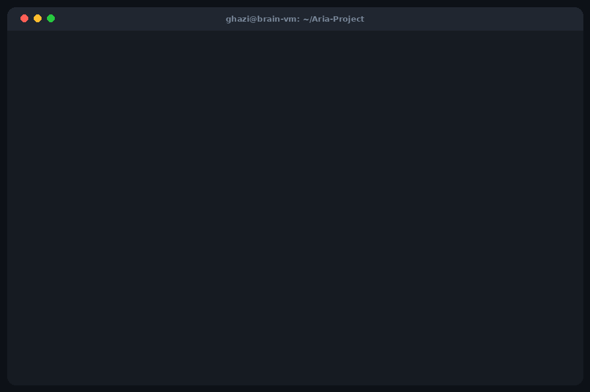
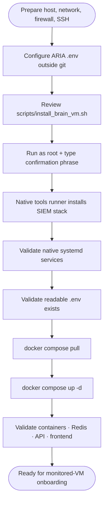
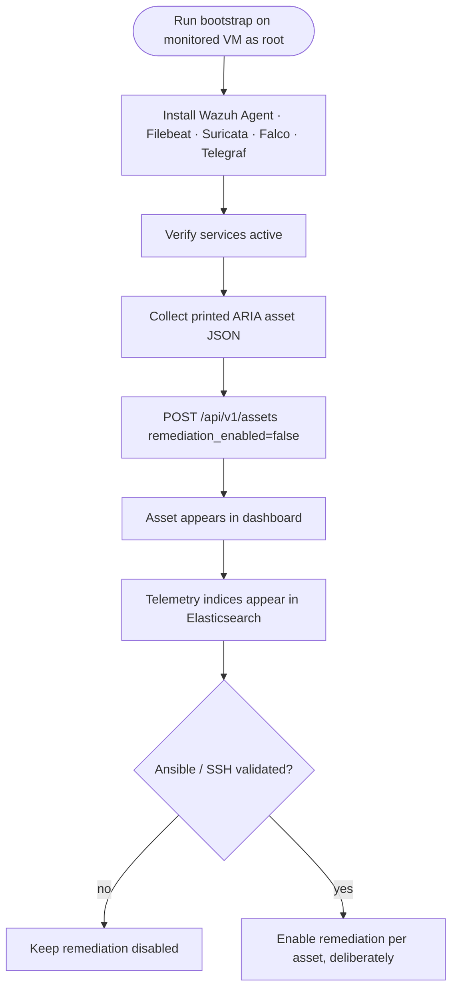
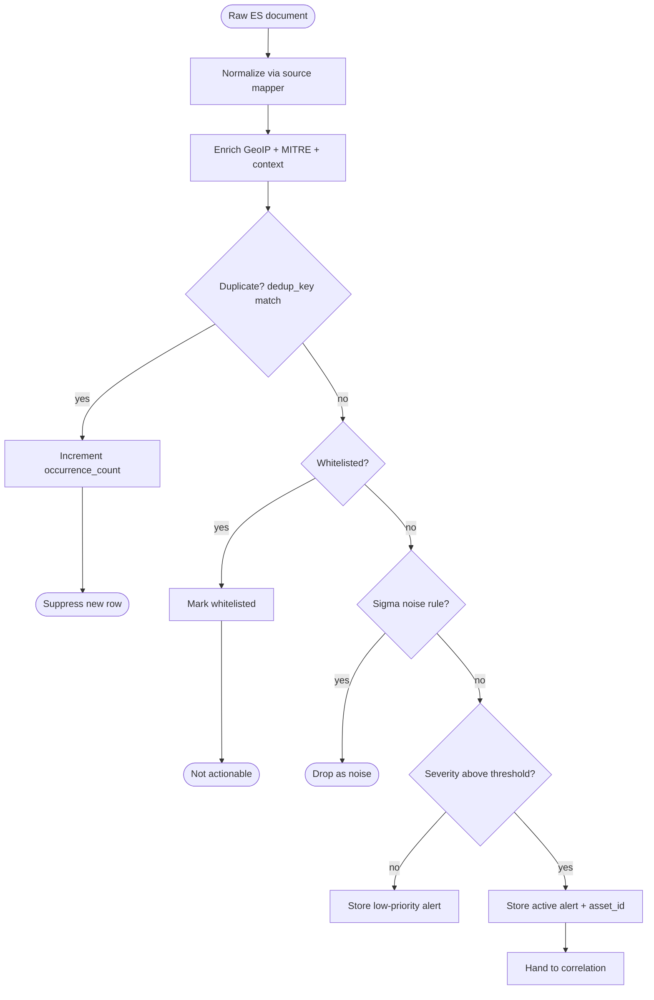
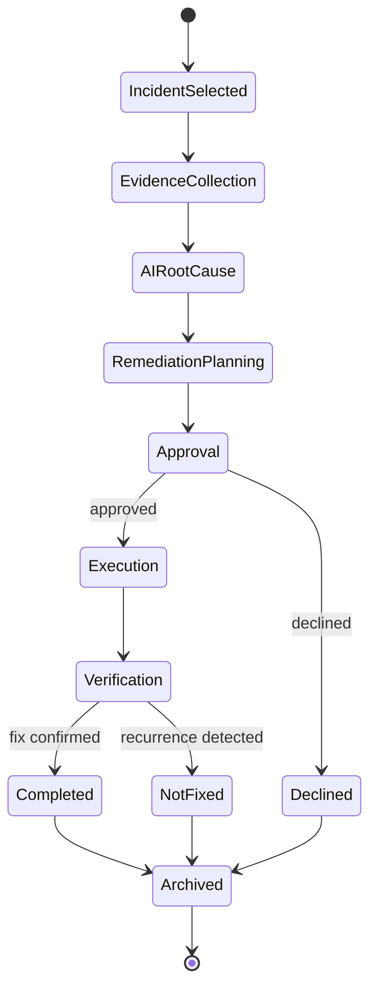

```mermaid
flowchart LR
    A[Monitored/central agents] --> B[(Elasticsearch)]
    B --> C[ARIA worker polls ES indices]
    C --> D[source mapper normalizes alert]
    D --> E[enrich: GeoIP · MITRE · Sigma · anomaly]
    E --> F[dedup: Redis-first, SQLite fallback]
    F --> G[correlate into incidents]
    G --> H[(SQLite alerts/incidents)]
    H --> I[optional LLM investigation]
    I --> J{approval-gated Ansible}
    J --> K[SSH remediation]
    K --> L[Elasticsearch re-query verification]
    L --> M[archive + PDF]
    M --> N[FastAPI REST/WebSocket :8001]
    N --> O[Next.js dashboard :3001]
```

<!-- ░░░░░░░░░░░░░░░░░░░░░░░░░░░░░░░░░░░░░░░░░░░░░░░░░░░░░░░░░░░░░░░░░░░░░ -->
<div align="center">


<h3>The local-first SOC / SOAR platform that <em>investigates</em> and <em>responds</em> — not just alerts.</h3>

<p>
ARIA turns the security telemetry you already collect into <b>correlated incidents</b>, <b>AI-driven investigations</b>, and <b>approval-gated Ansible remediation</b> — then verifies the fix against Elasticsearch and archives the case. No upstream SaaS required. Your data can stay entirely on your own <b>Brain VM</b>.
</p>

<p>


<br/>


</p>

<p>


</p>

<p><sub>Final-year engineering project (PFE) — <b>ESPRIT</b> × <b>Huawei</b> · 2025–2026 · by Ghazi Mabrouki</sub></p>

</div>

<!-- ░░░░░░░░░░░░░░░░░░░░░░░░░ HERO ░░░░░░░░░░░░░░░░░░░░░░░░░ -->
<div align="center">


<sub><i>Sign-in → live SOC dashboard → incident correlation → autonomous AI investigation → approval-gated, ES-verified response.</i></sub>

</div>

---

<div align="center">

### 📖 Table of Contents

[Why ARIA](#-why-aria-exists) ·
[Pipeline](#-the-detection-to-response-pipeline) ·
[Workflow](#-the-signature-feature-an-auditable-investigation-state-machine) ·
[Modules](#️-one-platform-many-lenses) ·
[Quick Start](#-quick-start) ·
[Brain VM Setup](#-brain-vm-setup-the-central-platform) ·
[Monitored VM Setup](#️-monitored-vm-onboarding) ·
[Configuration](#️-configuration-env) ·
[Ports](#-ports--traffic-direction) ·
[Architecture](#️-architecture) ·
[Validation](#-validation--troubleshooting) ·
[Tech Stack](#-tech-stack) ·
[Limitations](#-confirmed-limitations)

</div>

---

## 🧭 Why ARIA exists

Most SOC stacks stop at **detection** — they hand an analyst a wall of alerts and walk away. ARIA closes the loop:

> ### Telemetry → Incident → Investigation → *Approved Action* → Verification → Archive

It reads the telemetry already flowing into Elasticsearch (**Wazuh, Suricata, Falco, Telegraf**), **normalizes and enriches** it, **correlates** related signals into incidents, **investigates** them with an LLM, proposes a **staged Ansible playbook**, executes **only after a human approves**, then **re-queries Elasticsearch to prove the threat is gone** before archiving the case with full evidence — exportable to PDF.

Everything runs on a single **Brain VM** you control. The LLM can be a local **Ollama** model, so your data never has to leave the box.

---

## 🌊 The detection-to-response pipeline

<div align="center">

</div>

<table>
<tr>
<td width="33%" valign="top">

**① Ingest & normalize**
The worker polls Elasticsearch, maps each source (Wazuh / Suricata / Falco / Filebeat / generic) into one canonical alert schema, normalizes severity, and extracts IOCs.

</td>
<td width="33%" valign="top">

**② Enrich & de-noise**
GeoIP, MITRE ATT&CK, threat-intel and campaign tagging; **3-tier dedup** (Redis → memory → SQLite) and **Sigma** noise filtering keep the signal clean.

</td>
<td width="33%" valign="top">

**③ Correlate**
A multi-level correlation hierarchy groups alerts into **incidents**, tracks kill-chain phase, and links Suricata ↔ Wazuh views of the same event.

</td>
</tr>
<tr>
<td valign="top">

**④ Investigate (AI)**
Evidence collection → LLM root-cause → a **staged remediation plan** (evidence · dry-run · containment · hardening · forensics · verification). A deterministic path exists when you'd rather not trust the model.

</td>
<td valign="top">

**⑤ Respond (gated)**
Nothing executes without **explicit approval**, protected by an admin secret. Ansible runs in stages with **dry-run**, firewall safety and **rollback** built in.

</td>
<td valign="top">

**⑥ Verify & archive**
A delayed Elasticsearch recurrence query plus active state checks decide the **fix status**. The case — evidence, playbook, AI analysis — is archived and exportable to **PDF**.

</td>
</tr>
</table>

---

## 🤖 The signature feature: an auditable investigation state machine

Every case — **security, infrastructure, or runtime** — walks the **same eight-step workflow**. No black box: each step shows its evidence, its command output, and its exit code.

<div align="center">

</div>

```
 Incident ─▶ Evidence ─▶ AI Root-Cause ─▶ Remediation Plan ─▶ Approval ─▶ Ansible ─▶ Verification ─▶ Archived
   sel.        collect      LLM analysis      staged playbook    human       staged       ES re-query     evidence
                                                                 gate        exec         + state         + PDF
```

---

## 🛰️ One platform, many lenses

<div align="center">

</div>

<table>
<tr>
<th>🛡️ Security Operations</th>
<th>📈 Infrastructure & Performance</th>
<th>🧬 Runtime Security</th>
</tr>
<tr>
<td valign="top">

- Real-time **SOC dashboard** (severity, MITRE, trends, health)
- **Alerts** with IOC extraction & related-incident pivots
- **Incident** correlation & one-click *Investigate*
- **IPS Map** — live attack paths on a world map
- **Whitelist** management (IP / subnet / domain)

</td>
<td valign="top">

- **Performance** — live CPU / memory / disk / network (Telegraf)
- **Top processes** by CPU & memory, per host
- **Infrastructure anomalies** auto-diagnosed by AI
- Resource gauges, thresholds & root-cause cards

</td>
<td valign="top">

- **Falco**-driven host & container behavior analysis
- Process / file / privilege-escalation classification
- Threat classification with confidence + decision routing
- Diagnostics-only by default; remediation behind approval

</td>
</tr>
<tr>
<th>🧠 AI Intelligence</th>
<th>🌐 Multi-server</th>
<th>📦 System Management</th>
</tr>
<tr>
<td valign="top">

- **AI Assistant** — context-aware chat across the whole estate
- **AI Operator** — natural language → Ansible, with confirmation
- Pluggable LLM: **Ollama**, Gemini, OpenRouter, NVIDIA NIM
- Deterministic bypass for trust-critical actions

</td>
<td valign="top">

- **Monitored assets** with per-asset scoping
- Roles: **super_admin** & **server_user**
- Per-asset index patterns & credentials
- Onboard a new VM with a single bootstrap script

</td>
<td valign="top">

- **Archives** with verified fix status & **PDF** export
- Full **audit log** of every state change
- **Settings center** (data sources, AI, workflow, Ansible…)
- WebSocket-driven live updates everywhere

</td>
</tr>
</table>

<details>
<summary><b>📸 Click to expand the full screenshot gallery</b></summary>

<br/>

| Sign-in | Security Dashboard |
|:--:|:--:|
|  |  |

| Incident Correlation | AI Investigation (live) |
|:--:|:--:|
|  |  |

| Auditable SOC Workflow | AI Security Assistant |
|:--:|:--:|
|  |  |

| Performance Monitoring | Infrastructure Anomaly |
|:--:|:--:|
|  |  |

| Verified Archive (PDF-exportable) | |
|:--:|:--:|
|  | |

</details>

---

## ⚡ Quick Start

> **Mental model:** ARIA = a **Brain VM** (central) + one or more **Monitored VMs** (agents only). The Brain VM hosts Elasticsearch/Kibana/Wazuh/Suricata/Falco/Telegraf **and** the ARIA Docker Compose stack. Monitored VMs only *send telemetry*.

<div align="center">

</div>

**The 60-second version (ARIA application only, on a host that already has a reachable Elasticsearch):**

```bash
git clone https://github.com/Ghazimabrouki/Aria-Project.git
cd Aria-Project/aria-application

cp .env.example .env        # then edit: Elasticsearch, LLM, admin secret
docker compose pull
docker compose up -d

curl -s http://localhost:8001/health      # -> {"status":"ok"}
# Dashboard:  http://<host>:3001
```

For a **full production-style Brain VM** (native SIEM stack + ARIA), use the guided installer below.

---

## 🧠 Brain VM Setup (the central platform)

The Brain VM is the single central host. The guided installer `scripts/install_brain_vm.sh` is intentionally thin and **safety-gated** — it requires you to type an explicit confirmation phrase.



### Prerequisites

- **Linux** (Debian/Ubuntu) with **root**, **systemd**, and outbound access to package repos (Elastic, Wazuh, Falco, InfluxData, GitHub).
- **Docker** + **Docker Compose plugin** already installed (`docker compose version` must work).
- An ARIA **`.env`** prepared next to the Compose file — see [Configuration](#️-configuration-env).

### Run the installer

```bash
git clone https://github.com/Ghazimabrouki/Aria-Project.git
cd Aria-Project

# prepare secrets first (never commit this file)
cp aria-application/.env.example aria-application/.env
nano aria-application/.env

# run the guided, safety-gated installer as root
sudo bash scripts/install_brain_vm.sh
# when prompted, type exactly:
#   I_UNDERSTAND_THIS_CONFIGURES_THE_BRAIN_VM
```

> ### ⚠️ Destructive-action warning
> The native tool scripts under `aria-tools-setup/tools/` may **install, purge, reconfigure, start, stop, or harden** services (including `apt-get purge` of an existing SIEM, certificate/password regeneration, UFW rules, and SSH hardening such as `PermitRootLogin no` / `PasswordAuthentication no`). **Run only on the intended Brain VM, only after review.** A mistargeted run can destroy an existing SIEM or lock you out via SSH/UFW.

### What the installer brings up

<table>
<tr><th>Native systemd services</th><th>ARIA Compose containers</th></tr>
<tr><td valign="top">

`elasticsearch` · `kibana` · `filebeat`
`suricata` · `wazuh-manager`
`falcosidekick` · `telegraf` · `fail2ban`
**+ exactly one** Falco unit:
`falco-modern-bpf` / `falco-bpf` / `falco-kmod`

</td><td valign="top">

`aria-redis`   → `:6380`
`aria-api`     → `:8001`
`aria-worker`  → (internal)
`aria-frontend`→ `:3001`

</td></tr>
</table>

### Access after install

| Endpoint | URL |
|---|---|
| 🖥️ Dashboard | `http://<BRAIN_VM_IP>:3001` |
| ❤️ API health | `http://127.0.0.1:8001/health` |
| 📚 API docs (OpenAPI) | `http://127.0.0.1:8001/docs` |
| 🔎 Kibana | `https://<BRAIN_VM_IP>:5601` |

📄 Full guide: [`docs/deployment/BRAIN_VM_SETUP.md`](docs/deployment/BRAIN_VM_SETUP.md)

---

## 🖥️ Monitored VM Onboarding

A monitored server runs **telemetry producers only** (Wazuh Agent, Filebeat, Suricata, Falco/Falcosidekick, Telegraf). It never runs the ARIA API, worker, Redis, SQLite, Kibana, Elasticsearch, or the Wazuh Manager.



### 1 · Bootstrap the agents (on the monitored VM, as root)

```bash
# copy a reviewed bootstrap_monitored_vm.sh to the server, then:
export ARIA_ES_PASSWORD='<elasticsearch-password>'   # never pass on the CLI

bash bootstrap_monitored_vm.sh --all \
  --vm-name   <MONITORED_VM_NAME> \
  --ip        <MONITORED_VM_IP> \
  --es-ip     <BRAIN_VM_IP> \
  --es-user   <ELASTICSEARCH_USERNAME> \
  --wazuh-manager <BRAIN_VM_IP> \
  --wazuh-group   default
```

The script prints a **JSON asset payload** (with `remediation_enabled=false`).

### 2 · Register the asset with ARIA (from any host that can reach the Brain VM)

```bash
curl -sS -X POST http://<BRAIN_VM_IP>:8001/api/v1/assets \
  -H 'Content-Type: application/json' \
  -H 'X-ARIA-Admin-Secret: <ADMIN_SECRET>' \
  -d @asset-payload.json
```

### 3 · Verify

```bash
# on the monitored VM
systemctl is-active wazuh-agent filebeat suricata telegraf falcosidekick

# on the Brain VM (credentials required; do not echo them)
/var/ossec/bin/agent_control -l
curl -sS http://127.0.0.1:8001/api/v1/assets -H 'X-ARIA-Admin-Secret: <ADMIN_SECRET>'
```

> 🔒 **Keep `remediation_enabled=false`** until SSH connectivity, host-key policy, playbook scope, approval flow, and rollback are all reviewed. Flip it to `true` per asset, deliberately. Deleting an asset removes **only** its ARIA registry row — agents, Wazuh enrollment, SSH access, and ES indices must be cleaned up manually.

📄 Full guide: [`docs/deployment/MONITORED_VM_ONBOARDING.md`](docs/deployment/MONITORED_VM_ONBOARDING.md) · ⚠️ The Ansible material in `ansible-vm-setup/` ships **plaintext credentials** — sanitize and rotate before any real use.

---

## ⚙️ Configuration (`.env`)

Copy `aria-application/.env.example` → `.env` and fill in real values. **Never commit `.env`.** The most important keys:

| Key | What it does | Notes |
|---|---|---|
| `ELASTICSEARCH_URL` / `_USER` / `_PASSWORD` | Telemetry source & verification queries | **Required.** Password has no default. |
| `ELASTICSEARCH_USE_SSL` | TLS verification toggle | `false` disables cert verify (lab only). |
| `SECRET_KEY` | JWT signing secret | Set a long random string. |
| `ARIA_ADMIN_SECRET` / `ARIA_ADMIN_USERS` | Gate for admin/state-changing endpoints | Set a strong secret. |
| `LLM_PROVIDER` / `LLM_MODEL` | AI engine selection | `ollama` (local), `gemini`, `openrouter`, `nvidia`, or `auto`. |
| `OLLAMA_HOST` | Local LLM endpoint | e.g. `http://<host>:11434`. |
| `ANSIBLE_ENABLED` + SSH vars | Remediation transport | Key recommended over password. |
| `AUTO_APPROVE_ENABLED` | Skip the human gate for low-risk fixes | Default `false` — keep it off until trusted. |
| `PERFORMANCE_*` | CPU/memory thresholds & poll interval | Drives infra anomaly detection. |
| `RATE_LIMIT_*` | API rate limiting | Enabled by default. |

---

## 🔌 Ports & traffic direction

| Port | Direction | Purpose | Exposure guidance |
|---|---|---|---|
| `22/tcp` | admin / Brain → hosts | SSH + Ansible | Trusted admin CIDR only |
| `1514/tcp+udp` | monitored → Brain | Wazuh agent events | Monitored networks only |
| `1515/tcp` | monitored → Brain | Wazuh enrollment | Monitored networks only |
| `55000/tcp` | admin → Brain | Wazuh API | Internal only |
| `9200/tcp` HTTPS | agents / ARIA → Brain | Elasticsearch ingest & query | Monitored/Brain networks |
| `5601/tcp` HTTPS | analyst → Brain | Kibana | VPN / analyst CIDR |
| `8001/tcp` | analyst / frontend → API | REST · docs · WebSocket | Behind authenticated TLS proxy |
| `3001→3000` | analyst → frontend | Dashboard | `http://<brain>:3001` |
| `6380→6379` | API/worker → Redis | Cache / state | Bind loopback/internal in prod |
| `2801/tcp` | Falco → local sidekick | Runtime events | Local flow only |
| `11434/tcp` | worker → Ollama | Local LLM | Only if Ollama selected |

---

## 🏗️ Architecture

<details open>
<summary><b>High-level deployment</b></summary>


</details>

<details>
<summary><b>End-to-end data flow</b></summary>



</details>

<details>
<summary><b>Alert-processing decision pipeline</b></summary>



</details>

<details>
<summary><b>Investigation state machine</b></summary>



</details>

<details>
<summary><b>Component responsibility & failure impact</b></summary>

| Component | Tech | Responsibility | If it fails |
|---|---|---|---|
| Elasticsearch | native | Telemetry ingest/query; verification source | All ingest, dashboards, verification stop |
| Kibana | native | Raw search, rules, dashboards | Analyst loses raw SIEM UI |
| Wazuh Manager | native | Agent events & enrollment | Host alerts/enrollment stop |
| Filebeat | native | Ship logs/alerts to ES | Affected pipelines stop |
| Suricata | native | Network IDS | Network visibility lost |
| Falco + Falcosidekick | native | Runtime detection → ES | Runtime detections stop |
| Telegraf | native | Host metrics → ES | Metrics investigations stale |
| ARIA Redis | compose | Cache, dedup, pub/sub, rate-limit | Stateful ops degrade |
| ARIA API | compose | REST/WebSocket | UI/API down; worker may continue |
| ARIA worker | compose | Poll→enrich→correlate→investigate→remediate→verify→archive | No fresh processing |
| ARIA frontend | compose | Dashboard | Users lose UI; backend continues |
| SQLite | bind-mount | Workflow state | Single point of operational-state failure |
| Ansible + SSH | worker image | Approved remediation | Automated response unavailable |
| LLM provider | Ollama/external | AI analysis & playbooks | AI degrades; rule-based fallback |

</details>

---

## ✅ Validation & Troubleshooting

```bash
# Native services (Brain VM)
systemctl is-active elasticsearch kibana filebeat suricata wazuh-manager falcosidekick telegraf fail2ban
systemctl is-active falco-modern-bpf || systemctl is-active falco-bpf || systemctl is-active falco-kmod

# ARIA Compose stack
docker compose -f aria-application/docker-compose.yml ps
docker compose -f aria-application/docker-compose.yml exec -T redis redis-cli ping   # -> PONG
curl -s http://127.0.0.1:8001/health                                                 # -> {"status":"ok"}
curl -I http://127.0.0.1:3001                                                         # -> 200 / 307

# Logs
docker compose -f aria-application/docker-compose.yml logs --tail=200 api worker redis frontend
journalctl -u elasticsearch -u wazuh-manager -u filebeat --no-pager -n 200
```

📄 More: [`docs/operations/VALIDATION_AND_TROUBLESHOOTING.md`](docs/operations/VALIDATION_AND_TROUBLESHOOTING.md)

---

## 🧱 Tech Stack

| Layer | Technology |
|---|---|
| **Backend** | Python 3.12 · FastAPI · async SQLAlchemy 2.0 + aiosqlite · async Redis · httpx |
| **State** | SQLite (WAL + FTS5) — `data/investigations.db` · hand-rolled migrations |
| **Frontend** | Next.js 16 (App Router) · React · SWR · WebSocket · shadcn/ui · Tailwind |
| **Detection** | Wazuh · Suricata · Falco / Falcosidekick · Filebeat · Telegraf |
| **Source of truth** | Elasticsearch (read-only) + Kibana |
| **Response** | Ansible (staged · dry-run · rollback) via subprocess |
| **AI / LLM** | Ollama (local default) · Google Gemini · OpenRouter · NVIDIA NIM — `provider=auto` |
| **Auth** | JWT (python-jose) · bcrypt (passlib) · admin-secret gating |
| **Packaging** | Docker Compose (redis · api · worker · frontend) · reportlab (PDF) |

---

## 🗂️ Repository map

```text
aria-application/    ARIA FastAPI backend, worker, Next.js frontend, Docker Compose
  ├─ api/            FastAPI routes + WebSocket manager
  ├─ pipeline/       poll · map · enrich · dedup · correlate · forward
  ├─ response/       AI engines · watcher · ansible_exec · fix_verifier · models · db
  ├─ core/           Elasticsearch · Redis · GeoIP · circuit breaker
  ├─ config/         Pydantic settings · Sigma rules · inventory
  └─ frontend/       Next.js 16 dashboard
aria-tools-setup/    Native Brain VM SIEM/security installer scripts
ansible-vm-setup/    Ansible wrapper for monitored-VM onboarding (sanitize first)
docker-compose/      Duplicate Compose reference (not the primary authority)
aria-report/         Final-year report (LaTeX + PDF) and diagrams (reference)
docs/                Authoritative architecture / deployment / operations docs
scripts/             install_brain_vm.sh and operational wrappers
assets/              README media (generated GIFs, animated SVGs, screenshots)
```

---

## 📚 Documentation

- 🏗️ [Architecture](docs/architecture/ARIA_ARCHITECTURE.md) — components, data flow, ports, diagrams
- 🧠 [Brain VM setup](docs/deployment/BRAIN_VM_SETUP.md) — exact central deployment guide
- 🖥️ [Monitored VM onboarding](docs/deployment/MONITORED_VM_ONBOARDING.md) — agent boundaries
- ✅ [Validation & troubleshooting](docs/operations/VALIDATION_AND_TROUBLESHOOTING.md)
- 🔐 [Security & secrets](docs/operations/SECURITY_AND_SECRETS.md)
- 💾 [Backup & decommission limitations](docs/operations/BACKUP_AND_DECOMMISSION_LIMITATIONS.md)

---

## ⚠️ Safety warnings

- Central setup scripts in `aria-tools-setup/tools/` may **install, purge, reconfigure, start, stop, or harden** services on the host they run on. Run only on the intended Brain VM, only after review.
- Secrets — `.env`, passwords, tokens, private keys, live inventories, runtime evidence — must **never be committed**.
- The Ansible material in `ansible-vm-setup/` and historical content contains **plaintext credentials**; sanitize and rotate before production use.

## 🚧 Confirmed limitations

- **Single central platform** — one Brain VM with local Elasticsearch; no clustering or HA.
- **SQLite workflow state** — operational state lives in a local SQLite database.
- **Mutable image tags** — Compose uses `latest` tags from Docker Hub.
- **Backup/recovery incomplete** — full-stack / off-host / DR procedures are unproven.
- **Production hardening required** — TLS termination, exposure boundaries, authorization coverage, SSH host-key verification, and secrets handling need review.
- **Not implemented** — Kafka, active Neo4j, Kubernetes, Terraform, SSO, automated cloud provisioning.

---

## 🎓 Project context

ARIA is a final-year engineering graduation project (**PFE**) developed at **ESPRIT** in partnership with **Huawei** (academic year 2025–2026) by **Ghazi Mabrouki**. The full report and presentation live under [`aria-report/`](aria-report/) and are **historical/reference** material — current source code overrides them where they conflict.

<div align="center">
<br/>

<br/>
<sub>Built for analysts who want their tools to <b>act</b>, not just alert. ⚡</sub>
</div>
