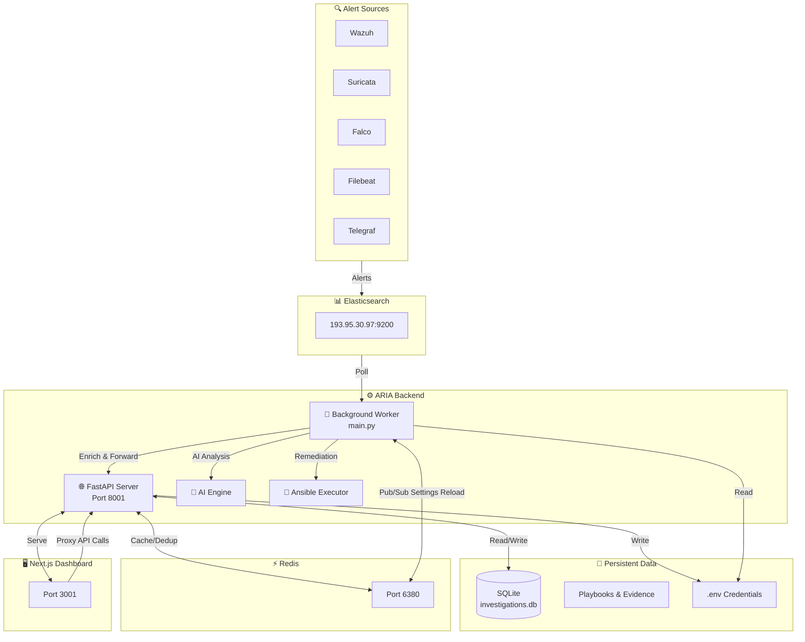
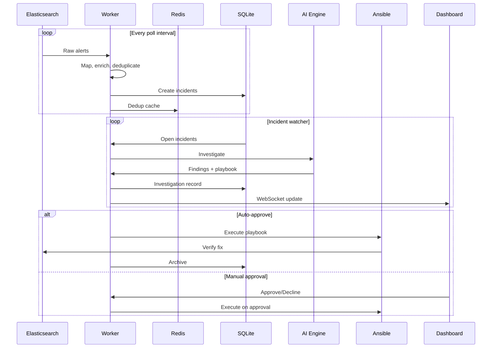
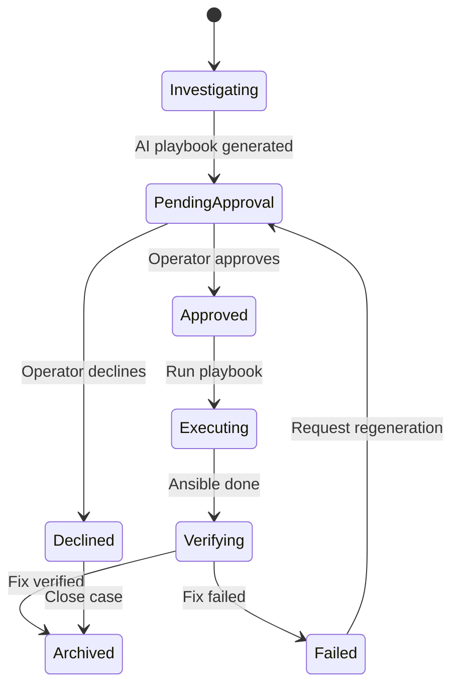

# 🛡️ ARIA — Adaptive Response Intelligence Automation

[](https://hub.docker.com/r/ghaziiii/aria_project)
[](https://fastapi.tiangolo.com)
[](https://nextjs.org)
[](https://python.org)
[](https://redis.io)
[](./LICENSE)

> **OpenSOAR** reimagined — ARIA is a security operations platform that ingests alerts from multiple sources, correlates them into incidents, investigates them with AI, and automatically remediates threats using Ansible.

---

## 📑 Table of Contents

1. [What is ARIA?](#what-is-aria)
2. [Architecture](#architecture)
3. [Tech Stack](#tech-stack)
4. [Features](#features)
5. [Quick Start](#quick-start)
6. [Project Structure](#project-structure)
7. [Configuration](#configuration)
8. [Deployment](#deployment)
9. [Development](#development)
10. [Screenshots & Flows](#screenshots--flows)
11. [Roadmap](#roadmap)
12. [Credits](#credits)

---

## 🎯 What is ARIA?

ARIA is an **AI-powered Security Orchestration, Automation and Response (SOAR)** platform built for modern SOC workflows.

It continuously polls security data sources, turns raw alerts into structured incidents, investigates them using LLMs, generates Ansible remediation playbooks, manages human or auto-approval workflows, executes fixes, verifies them, and archives resolved cases.

### Core Philosophy

- **Ingest everything** — Wazuh, Suricata, Falco, Filebeat, Telegraf
- **Correlate locally** — no upstream dependency required
- **Investigate with AI** — multi-provider LLM support with rule-based fallback
- **Remediate automatically** — Ansible playbooks generated and executed per asset
- **Keep humans in control** — approval workflows before destructive actions

---

## 🏗️ Architecture



### Data Flow



---

## 🧰 Tech Stack

### Backend
| Technology | Purpose |
|------------|---------|
| **Python 3.12** | Core language |
| **FastAPI** | Async HTTP API |
| **Uvicorn** | ASGI server |
| **SQLAlchemy 2.0 + aiosqlite** | Async SQLite ORM |
| **Redis** | Caching, deduplication, pub/sub |
| **Elasticsearch** | Alert source |
| **Ansible** | Remediation execution |
| **structlog** | Structured logging |
| **pydantic-settings** | Configuration management |

### Frontend
| Technology | Purpose |
|------------|---------|
| **Next.js 16** | React framework |
| **React 19** | UI library |
| **TypeScript 5.7** | Type safety |
| **Tailwind CSS v4** | Styling |
| **shadcn/ui** | Component library |
| **recharts** | Charts |
| **react-simple-maps** | Geographic visualization |
| **swr** | Data fetching |

### AI/LLM Providers
- NVIDIA NIM
- Ollama
- OpenAI
- Anthropic
- Google
- OpenRouter
- Rule-based fallback (PyRCA)

---

## ✨ Features

### Alert Ingestion & Processing
- [x] Multi-source polling: Wazuh, Suricata, Falco, Filebeat, Telegraf
- [x] Source-specific mappers
- [x] GeoIP enrichment
- [x] MITRE ATT&CK mapping
- [x] Sigma noise filtering
- [x] Redis + file-based deduplication
- [x] Cursor management for resumable polling

### Incident Management
- [x] Automatic incident correlation
- [x] Severity scoring
- [x] Asset scoping
- [x] Timeline generation
- [x] Comment and review workflows

### AI Investigation Engine
- [x] Multi-provider LLM support
- [x] Prompt engineering pipeline
- [x] Response parsing & validation
- [x] Ansible playbook generation
- [x] Evidence collection
- [x] Fix verification logic

### Remediation & Approval
- [x] Per-asset Ansible configuration
- [x] SSH key and password authentication
- [x] Sudo/su privilege escalation
- [x] Human approval workflow
- [x] Auto-approval (static/dynamic/AI/hybrid)
- [x] Fix verification via Elasticsearch re-query
- [x] Rollback support

### Dashboard & UX
- [x] Real-time WebSocket updates
- [x] Alerts, incidents, investigations, archives views
- [x] Performance monitoring
- [x] Pipeline health dashboard
- [x] Search across all entities
- [x] Settings management with runtime reload
- [x] Dark/light mode

---

## 🚀 Quick Start

### Prerequisites
- Docker + Docker Compose
- `.env` file with your credentials (see [Configuration](#configuration))

### Run the Full Stack

```bash
cd "/home/dash/Desktop/Aria_Project/Front_end + back_end"

# Pull latest images and start
docker compose pull
docker compose up -d
```

### Access the App

| Service | URL |
|---------|-----|
| Dashboard | http://localhost:3001 |
| API Docs | http://localhost:8001/docs |
| API Health | http://localhost:8001/health |
| Redis | localhost:6380 |

### Stop the Stack

```bash
docker compose down
```

---

## 📁 Project Structure

```
.
├── api/                    # FastAPI app and route modules
│   ├── app.py             # FastAPI factory
│   ├── websocket.py       # WebSocket manager
│   └── routes/            # API endpoints
├── config/                # Settings, Sigma rules, inventory
├── core/                  # Elasticsearch, Redis, GeoIP clients
├── data/                  # SQLite DB, playbooks, evidence, backups
├── docs/                  # Architecture and runbook docs
├── frontend/              # Next.js dashboard
│   ├── app/              # App Router pages
│   ├── components/       # UI components
│   ├── lib/              # API client, auth, websocket
│   └── public/           # Static assets
├── pipeline/              # Alert ingestion and forwarding
│   ├── poller/           # Main forwarder loop
│   ├── mappers/          # Source-specific mappers
│   ├── enrichment/       # GeoIP, MITRE, Sigma
│   └── datausage/        # Runtime/datausage orchestrators
├── response/              # AI engine and response workflows
│   ├── ai_engine/        # LLM clients and prompt builders
│   ├── watcher/          # Incident watcher
│   └── models.py         # Database models
├── scripts/               # Operational and maintenance scripts
├── tests/                 # pytest unit and E2E tests
├── docker-compose.yml     # Docker Compose orchestration
├── Dockerfile.backend     # Backend Docker image
├── requirements.txt       # Python dependencies
└── README.md              # This file
```

---

## ⚙️ Configuration

All backend configuration is driven by the `.env` file at the project root.

### Required Sections

```ini
# Elasticsearch
ELASTICSEARCH_URL=https://193.95.30.97:9200
ELASTICSEARCH_USER=elastic
ELASTICSEARCH_PASSWORD=your_password
ELASTICSEARCH_USE_SSL=false

# Redis
REDIS_HOST=redis
REDIS_PORT=6379

# Admin
ARIA_ADMIN_SECRET=your-admin-secret
ARIA_ADMIN_USERS=admin,user2

# LLM
LLM_PROVIDER=nvidia
LLM_MODEL=meta/llama3-70b-instruct
NVIDIA_API_KEY=your-key

# Ansible (global fallback)
ANSIBLE_REMOTE_HOST=193.95.30.97
ANSIBLE_REMOTE_USER=ghazi
ANSIBLE_SSH_PASSWORD=your-ssh-password
ANSIBLE_BECOME_PASSWORD=your-sudo-password

# Per-asset credentials (recommended)
ARIA_ASSET_GHAZI_ANSIBLE_PASSWORD=your-password
ARIA_ASSET_GHAZI_BECOME_PASSWORD=your-sudo-password
```

### Runtime Settings Reload

Settings changed through the UI are written to `.env` and published to Redis. Both the API and worker containers reload automatically — **no container restart required**.

---

## 🚢 Deployment

### Docker Hub Images

All images are published to `ghaziiii/aria_project`:

```bash
# Pull all images
docker pull ghaziiii/aria_project:backend-latest
docker pull ghaziiii/aria_project:worker-latest
docker pull ghaziiii/aria_project:frontend-latest
docker pull ghaziiii/aria_project:redis-latest
```

### Production Considerations

- Mount `.env` read-write for runtime settings updates
- Mount `./data` for persistent SQLite and evidence
- Use a reverse proxy (nginx/traefik) with TLS for public access
- Tighten CORS origins beyond `localhost:3001`
- Schedule backups via `scripts/maintenance/backup_db.sh`

---

## 💻 Development

### Without Docker

```bash
# Backend
./run_backend.sh

# Frontend (port 3001)
cd frontend
pnpm install
PORT=3001 pnpm dev
```

### Run Tests

```bash
# Backend
pytest tests/ -v

# E2E
./run_e2e_tests.sh all
```

### Build Frontend Image Locally

```bash
cd frontend
docker build -t aria-frontend:latest .
```

---

## 🖼️ Screenshots & Flows

### Settings Architecture

```mermaid
flowchart LR
    subgraph UI["Dashboard Settings"]
        DS[Data Sources]
        RS[Redis]
        AI[AI]
        AN[Ansible]
        WF[Workflow]
        PL[Pipeline]
    end

    subgraph API["FastAPI"]
        S[/api/v1/settings]
        E[/api/v1/settings/env-var]
    end

    subgraph Storage
        ENV[.env file]
        R[(Redis Pub/Sub)]
    end

    subgraph Workers
        API_PROC[API Process]
        W_PROC[Worker Process]
    end

    DS --> S
    RS --> S
    AI --> S
    AN --> S
    WF --> S
    PL --> S
    S --> ENV
    S --> R
    E --> ENV
    E --> R
    R --> API_PROC
    R --> W_PROC
```

### Approval Workflow



---

## 🗺️ Roadmap

- [ ] Kubernetes Helm chart
- [ ] GitHub Actions CI/CD
- [ ] Multi-tenancy support
- [ ] MITRE ATT&CK navigator integration
- [ ] Custom Sigma rule editor
- [ ] Mobile-responsive dashboard v2
- [ ] Audit log export

---

## 👏 Credits

Built by **Ghazi Mabrouki** as part of an end-of-study project at **ESPRIT**.

Special thanks to the open-source communities behind FastAPI, Next.js, Redis, Elasticsearch, Ansible, and the shadcn/ui ecosystem.

---

<p align="center">
  <strong>ARIA — Automate the Response. Empower the Analyst.</strong>
</p>
