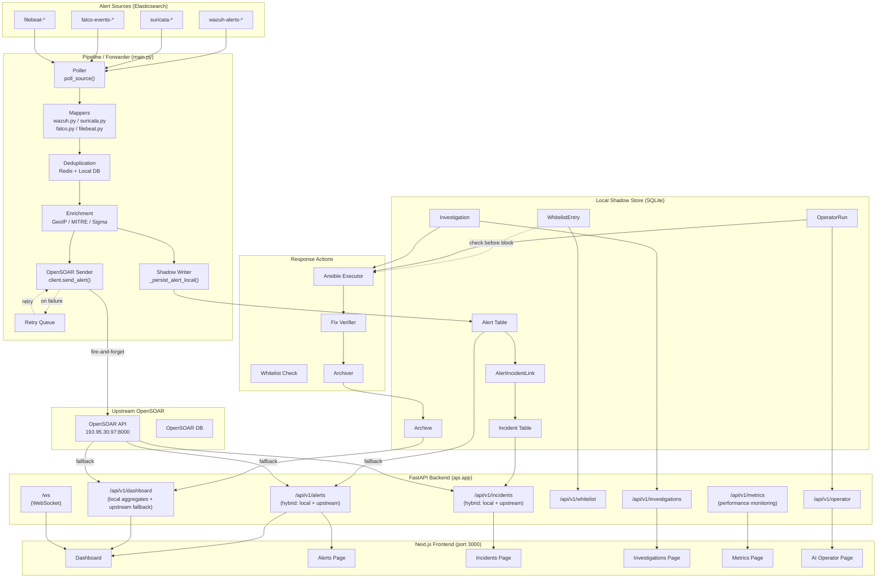
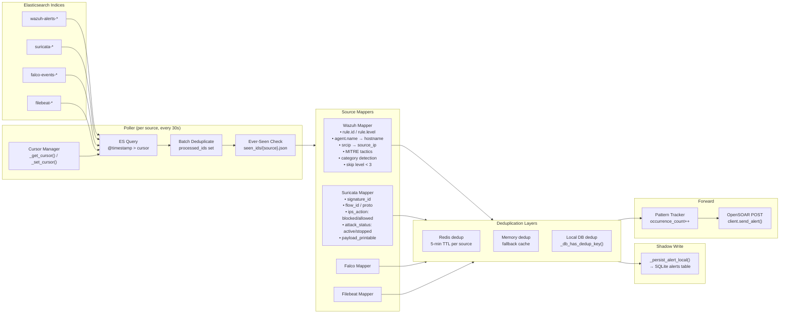
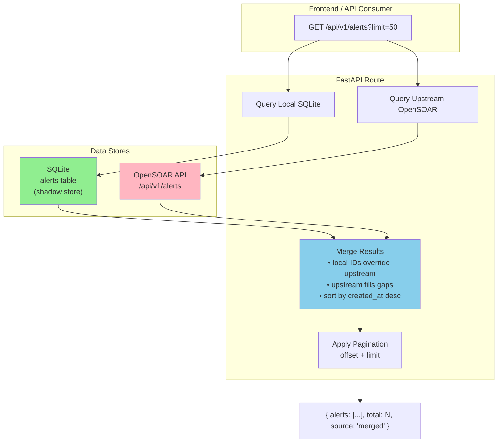
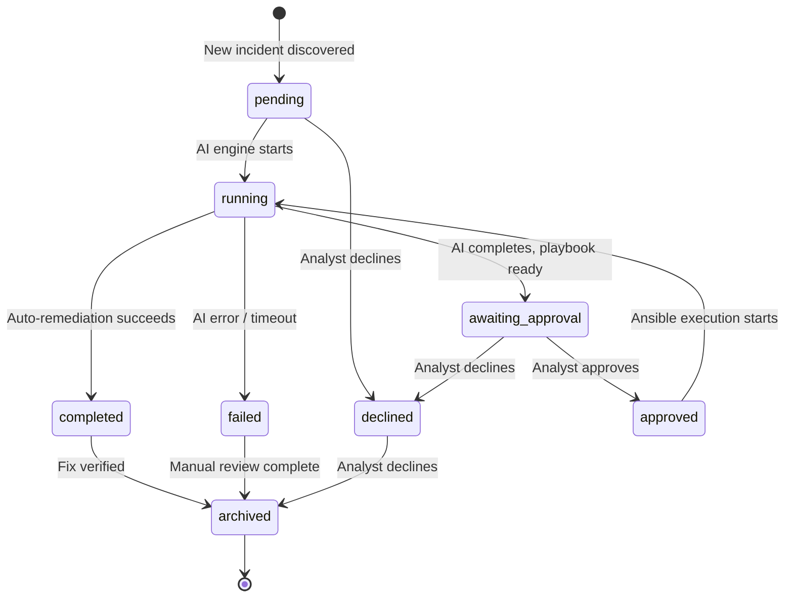
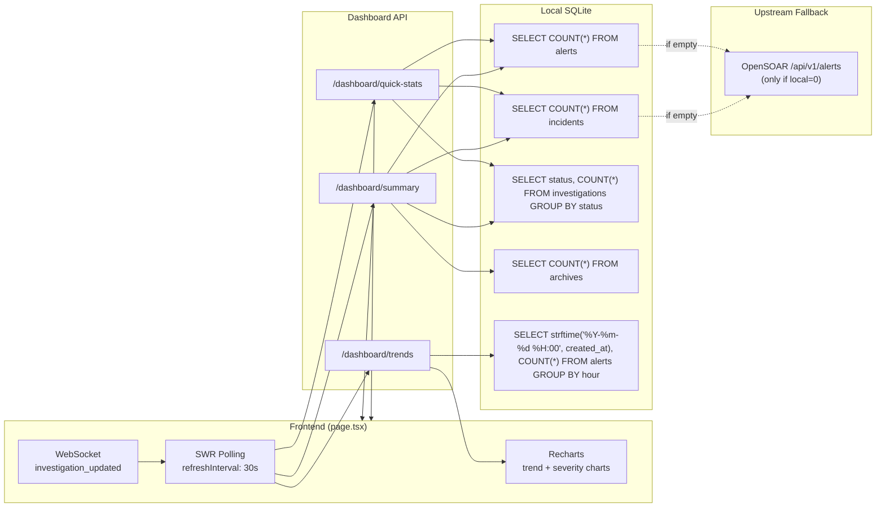
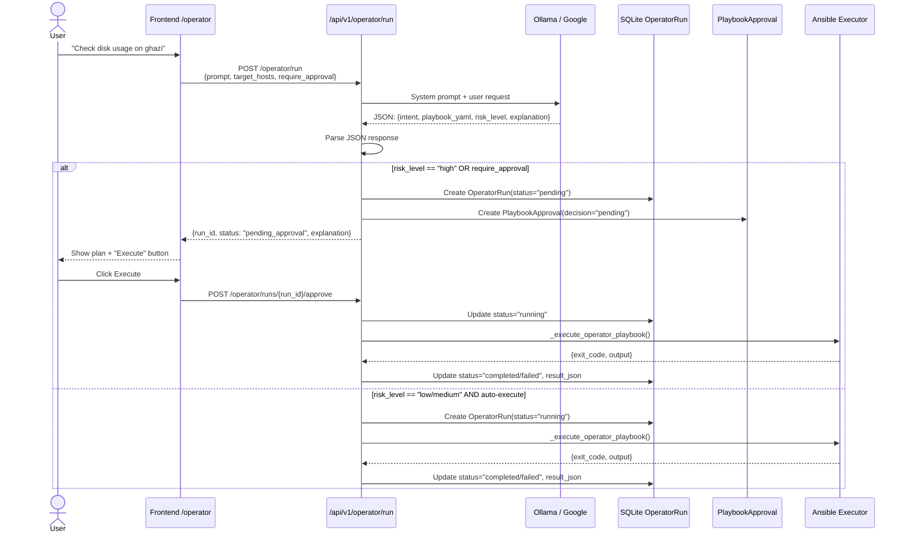
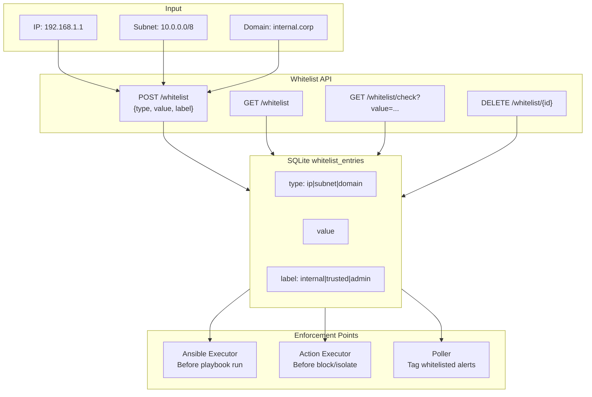
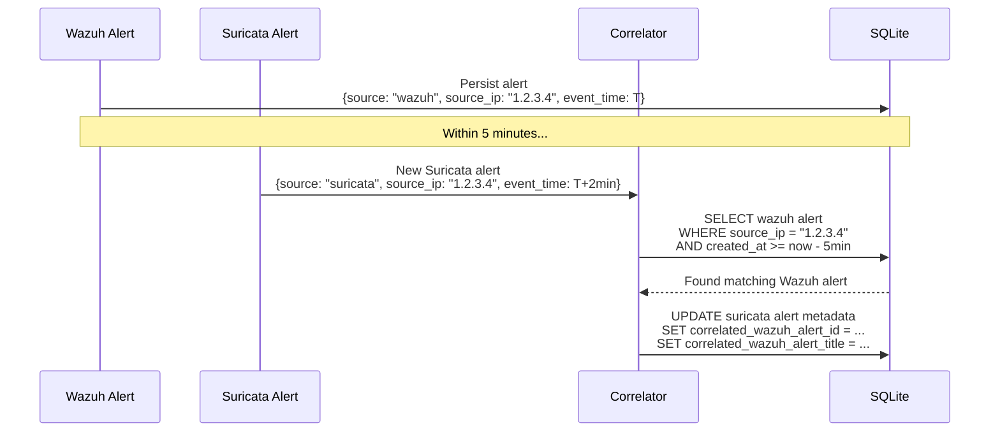
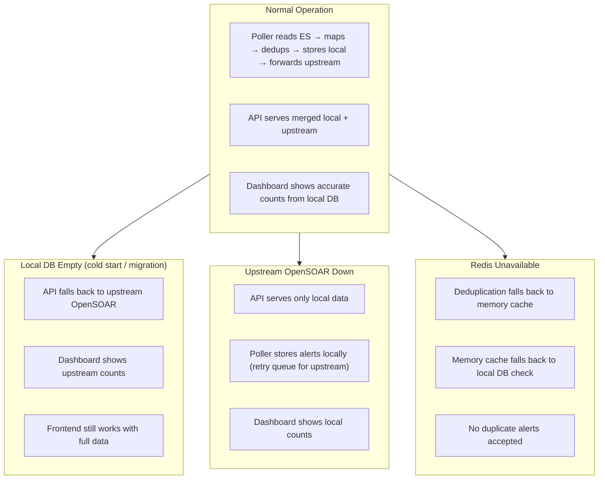

# OpenSOAR Backend — System Architecture

## 1. Overall System Architecture



---

## 2. Alert Ingestion Pipeline



### Key Design Decisions

| Layer | Purpose | TTL/Storage |
|-------|---------|-------------|
| Batch dedup | Same poll cycle duplicates | In-memory set |
| Ever-seen | Never resend same ES doc | `data/seen_ids/{source}.json` (50K max) |
| Redis dedup | Content-based dedup | 5 minutes |
| Local DB dedup | Cross-restart dedup | SQLite, same TTL as Redis |

---

## 3. Hybrid API Strategy



### Why Hybrid?

| Scenario | Behavior |
|----------|----------|
| Local DB empty (cold start) | Returns upstream data immediately |
| Local DB has some data | Merges local + upstream; local takes precedence |
| Local DB fully populated | Still queries upstream to fill gaps (e.g., old data not yet shadowed) |
| Network partition | Local DB serves stale but available data |

---

## 4. Investigation Lifecycle & State Machine



### State Transition Guards

```python
_ALLOWED_TRANSITIONS = {
    "pending": {"running", "declined"},
    "running": {"awaiting_approval", "completed", "failed"},
    "awaiting_approval": {"approved", "declined"},
    "approved": {"running"},
    "completed": {"archived"},
    "failed": {"archived"},
    "declined": {"archived"},
}
```

Invalid transitions return **HTTP 400** with allowed transitions list.

---

## 5. Dashboard Data Flow



### Dashboard Improvements vs Before

| Metric | Before | After |
|--------|--------|-------|
| Alerts total | `limit=200` upstream cap | Local `COUNT(*)` — no cap |
| Incidents total | `limit=200` upstream cap | Local `COUNT(*)` — no cap |
| Trend data | Client-side bucketing of 100 alerts | Server-side SQL `GROUP BY hour` |
| Time filters | None | `?range=15m\|1h\|24h\|7d` |
| Refresh | SWR 30s only | SWR 30s + WebSocket events |

---

## 6. AI Operator Flow



---

## 7. Whitelist System



---

## 8. Suricata ↔ Wazuh Correlation



---

## 9. Data Consistency & Failure Modes



---

## 10. File Structure

```
opensoar backend/
├── api/
│   ├── app.py                          # FastAPI app with all routers
│   ├── routes/
│   │   ├── alerts.py                   # Hybrid local/upstream alerts API
│   │   ├── incidents.py                # Hybrid local/upstream incidents API
│   │   ├── investigations.py           # Lifecycle + state transitions
│   │   ├── dashboard.py                # Local aggregates + trends
│   │   ├── whitelist.py                # Whitelist CRUD
│   │   ├── operator.py                 # AI Operator endpoints
│   │   └── ...
│   └── websocket.py                    # Real-time broadcasts
├── pipeline/
│   ├── poller/
│   │   ├── main.py                     # Forwarder loop
│   │   └── alert_processor.py          # _persist_alert_local(), _link_suricata_to_wazuh()
│   ├── mappers/
│   │   ├── wazuh.py                    # Category detection, level filter
│   │   ├── suricata.py                 # IPS action, attack_status
│   │   └── ...
│   ├── services/
│   │   ├── dedup.py                    # Redis + memory + local DB
│   │   └── correlator.py               # Campaign detection
│   └── sender.py                       # OpenSOARClient
├── response/
│   ├── models.py                       # Alert, Incident, WhitelistEntry, OperatorRun
│   ├── archiver.py                     # Archive investigation + update incident
│   ├── ansible_exec.py                 # Whitelist check before execution
│   └── ai_engine/                      # LLM clients, prompt builder
├── core/
│   └── whitelist.py                    # is_whitelisted(), check_alert_whitelist()
└── frontend/
    └── app/(dashboard)/
        ├── operator/page.tsx             # AI Operator chat UI
        └── ...
```

---

## 11. Reliability Checklist

| Component | Failure Mode | Mitigation |
|-----------|-------------|------------|
| Local SQLite | DB locked / corrupt | `aiosqlite` async driver, auto-retry on commit |
| OpenSOAR upstream | Network down / 503 | API falls back to local; poller uses retry queue |
| Redis | Connection refused | Deduplication falls back to memory → local DB |
| LLM (Ollama/Google) | Timeout / 503 | AI Operator returns error; investigation gets `ai_error` |
| Ansible target | SSH auth fail / unreachable | Status set to `failed`; retry possible |
| Whitelist | Missing critical entry | Default-deny for blocks; all checks are logged |
| Poller | ES query timeout | Skip cycle; cursor not advanced; retry next cycle |
| Frontend | Stale bundle | Hard refresh (`Ctrl+F5`) after rebuild |
