# Slide 1 — Title

# **ARIA**
## Adaptive Response Intelligence Automation

**AI-Assisted Security Operations, Incident Response, and Remediation Platform**

**Ghazi Mabrouki**

Professional Final Year Project (PFE) — Huawei Technologies
ESPRIT University — Academic Year 2025–2026

---

# Slide 2 — Problem Statement

# SOC Operations Are Fragmented and Slow

| Challenge | Impact |
|-----------|--------|
| **Fragmented tools** | Wazuh, Suricata, Falco, Telegraf each live in separate consoles |
| **Heterogeneous data** | Every source speaks a different JSON schema |
| **Alert overload** | 2,500+ alerts become noise without correlation |
| **Expert dependency** | Manual investigation takes ~40 minutes per incident |
| **No closed loop** | Remediation, verification, and audit are often manual or missing |

**Result:** analysts spend more time switching tools than acting on incidents.

---

# Slide 3 — Project Objectives

# Three Pillars

1. **Visibility**
   - Centralize host, network, runtime, and metric telemetry
   - Normalize alerts into one common operational model

2. **Intelligence**
   - Correlate alerts into incidents
   - Explain incidents and generate Ansible playbooks with AI

3. **Controlled Response**
   - Human approval gate for every sensitive action
   - Verify fixes before archiving; full audit trail

---

# Slide 4 — State of the Art

# SOC / SOAR Market Landscape

| Solution | Strength | Limitation |
|----------|----------|------------|
| Splunk Enterprise Security | Powerful SIEM, rich apps | Cost, heavy infrastructure |
| IBM QRadar | Correlation, asset DB | Complex deployment |
| Microsoft Sentinel | Cloud-native, AI alerts | Vendor lock-in |
| Palo Alto XSOAR | Strong playbook marketplace | Expensive, steep learning curve |
| Wazuh + ELK | Open, good visibility | No built-in SOAR/AI response |
| Falcon / SentinelOne | EDR-centric | Limited multi-layer correlation |

---

# Slide 5 — Identified Gap

# What Is Missing?

> No existing solution combines **multi-layer monitoring** (host, network, runtime, metrics) with **alert enrichment**, **incident correlation**, **AI-generated playbooks**, and **human-controlled Ansible remediation** in a single, open, local-deployment platform.

ARIA fills this gap by turning raw telemetry into actionable, approved, verifiable incidents.

---

# Slide 6 — Three-Phase Roadmap

# From Infrastructure to Intelligence

```
┌─────────────┐     ┌─────────────────┐     ┌─────────────────────┐
│  Phase 1    │ ──► │    Phase 2      │ ──► │      Phase 3        │
│ Monitoring  │     │  Cloud Infra    │     │ Backend Intelligence│
│ Foundation  │     │  Huawei Cloud   │     │  ARIA Platform      │
└─────────────┘     └─────────────────┘     └─────────────────────┘
   Jan–Feb              Feb–Mar                  Mar–Jul
```

- **Phase 1:** Elasticsearch, Kibana, Wazuh, Suricata, Falco, Filebeat, Telegraf, Redis
- **Phase 2:** VPC, subnet, security group, EIP, ECS on Huawei Cloud
- **Phase 3:** ARIA backend, dashboard, AI response, controlled remediation, onboarding

---

# Slide 7 — High-Level Architecture

# Four-Tier SOC Automation Stack

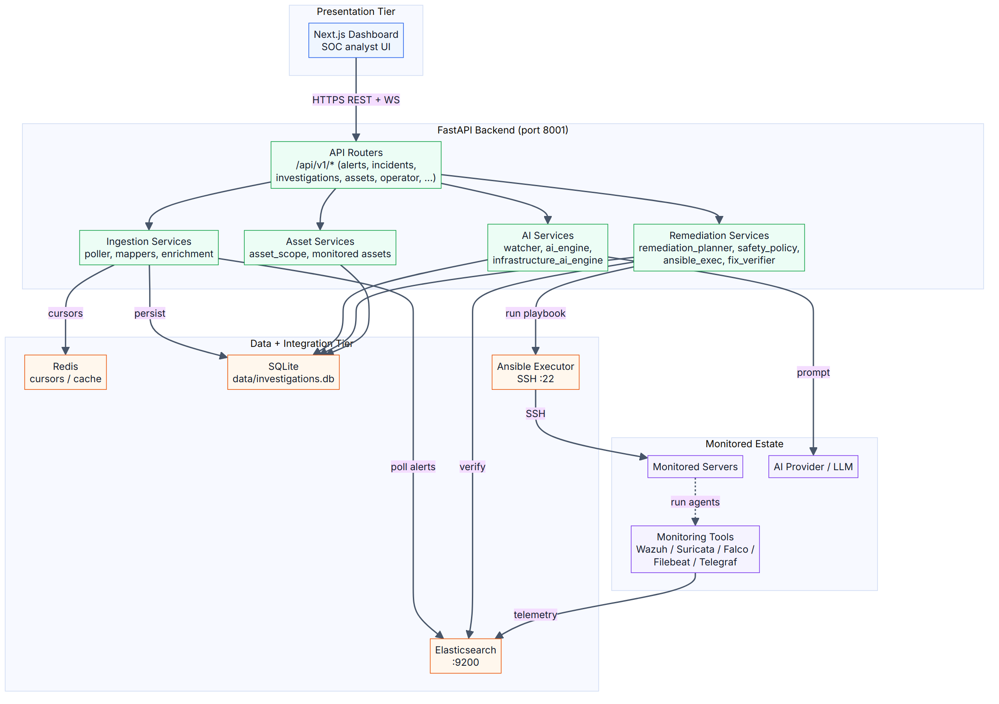

- **Presentation:** Next.js dashboard
- **API:** FastAPI + REST/WebSocket
- **Workflow:** Pipeline, correlation, AI engine, operator, runtime, infrastructure
- **Data + Integration:** Elasticsearch, Redis, SQLite, Ansible, monitored assets

---

# Slide 8 — Deployment Architecture

# Brain VM + Monitored VM on Huawei Cloud

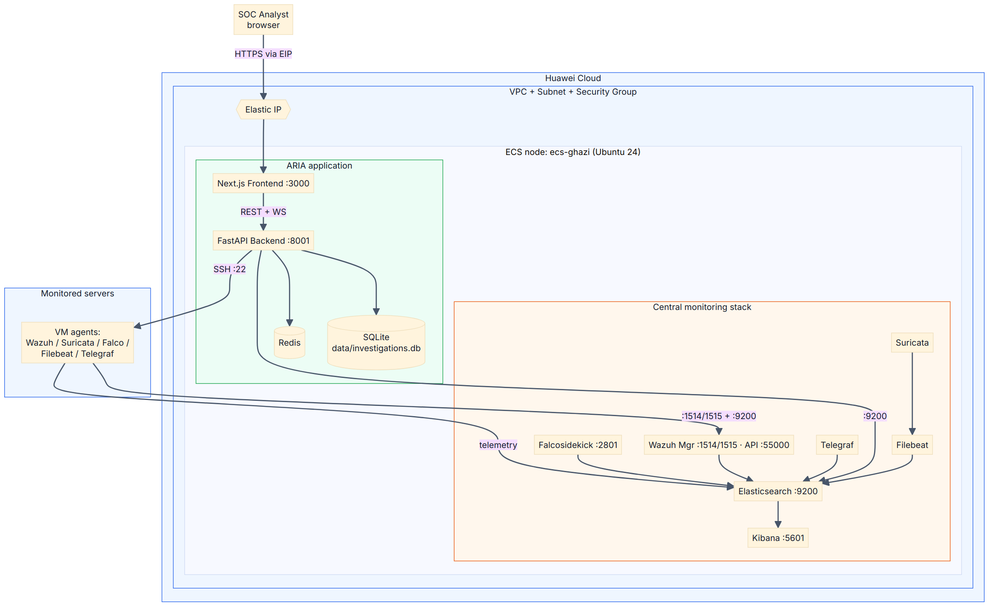

- Public Elastic IP → Security Group → ECS instances
- Brain VM hosts Elasticsearch, Kibana, Redis, ARIA backend, frontend
- Monitored VM runs Wazuh agent, Filebeat, Falco, Telegraf
- **Elasticsearch and Redis remain internal only**

---

# Slide 9 — Phase 1: Visibility Layers & Tools

# Monitoring Foundation

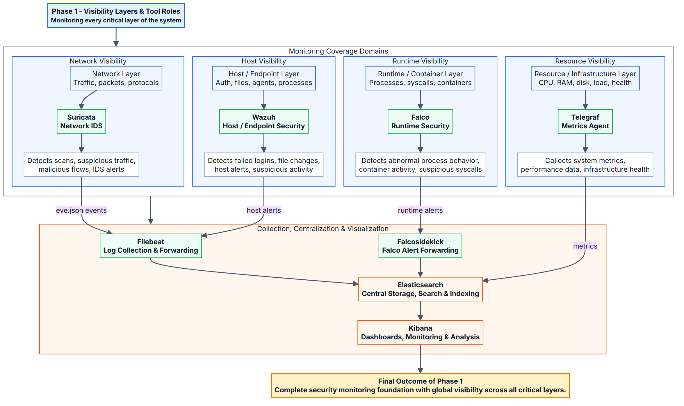

| Layer | Tool | Data |
|-------|------|------|
| Host | Wazuh | Authentication, file integrity, system activity |
| Network | Suricata + Filebeat | IDS/IPS alerts, protocol events |
| Runtime | Falco | Container and syscall anomalies |
| Metrics | Telegraf | CPU, memory, disk, network, processes |
| Cache / State | **Redis** | Cursors, dedup, baselines, retry queues |

---

# Slide 10 — Phase 1: Data Flow

# From Agents to Elasticsearch

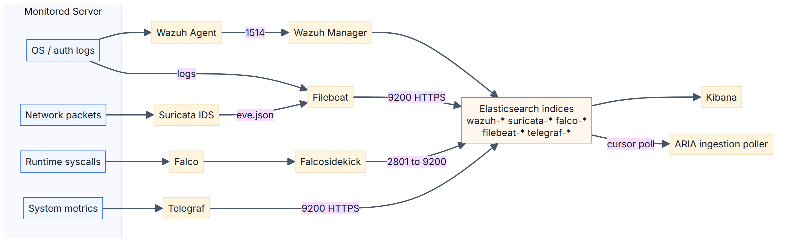

1. Wazuh, Suricata, Falco, Telegraf produce events
2. Filebeat / Falcosidekick forward to Elasticsearch
3. Kibana visualizes raw telemetry
4. ARIA polls the same Elasticsearch indices

---

# Slide 11 — Central Setup Script Flow

# Automated Foundation Deployment

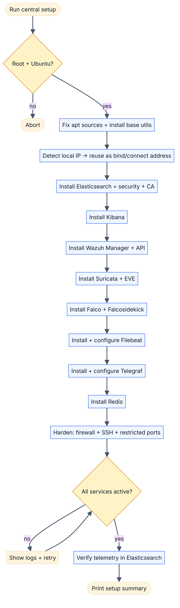

- One orchestrator script installs every component
- Per-component flags allow selective reinstall
- Each script is idempotent: detect → remove → install → configure → verify

---

# Slide 12 — Hardening & Validation

# Central Server Security

| Control | Implementation |
|---------|----------------|
| Firewall | UFW default-deny |
| SSH brute-force | Fail2Ban |
| Service exposure | Bind to local IP; public ports only where required |
| TLS | Elasticsearch uses HTTPS with custom CA |
| Secrets | No credentials in UI or logs |

Validation: service health checks + Kibana index verification

---

# Slide 13 — Phase 2: Huawei Cloud Topology

# Cloud Resources

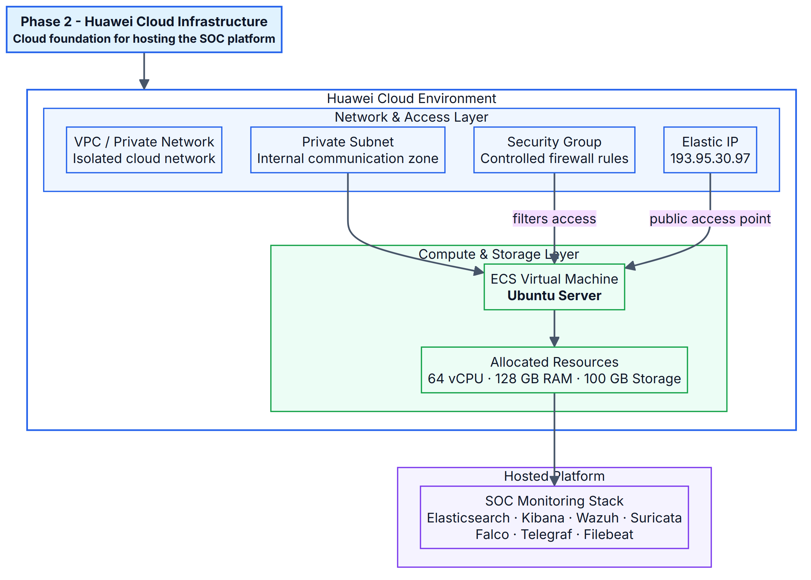

| Resource | Purpose |
|----------|---------|
| VPC | Isolated network |
| Subnet | Internal IP range |
| Security Group | Port-level access control |
| Elastic IP | Public access to analyst UI |
| ECS | Compute for Brain and Monitored VMs |

---

# Slide 14 — Security Strategy & Ports

# Exposure Principles

| Port | Service | Exposure |
|------|---------|----------|
| 3001 | ARIA frontend | Analyst/VPN only |
| 8001 | ARIA backend | Internal / frontend only |
| 9200 | Elasticsearch | **Internal only** |
| 5601 | Kibana | Restricted to analysts |
| 6379 | Redis | **Internal only** |
| 1514/1515 | Wazuh agent | Monitored hosts only |
| 55000 | Wazuh API | Administrative only |

**Rule:** Elasticsearch and Redis are **never** exposed to the public internet.

---

# Slide 15 — The 12-Step Intelligence Pipeline

# From Raw Alert to Closed Case

1. **Ingestion** — poll Elasticsearch every 10 s
2. **Mapping** — source-specific mappers normalize alerts
3. **Enrichment** — GeoIP, MITRE ATT&CK, IOCs
4. **Deduplication / noise filtering** — Redis + Sigma + DB
5. **SQLite storage** — operational shadow database
6. **Correlation** — group alerts into incidents
7. **Investigation** — create case and build context
8. **AI analysis** — summary, narrative, risk, playbook
9. **Approval** — analyst review + admin-secret gate
10. **Execution** — Ansible playbook on target host
11. **Verification** — re-check evidence / remote state
12. **Archive + dashboards** — close case with audit trail

---

# Slide 16 — Alert Ingestion

# Cursor-Based Polling

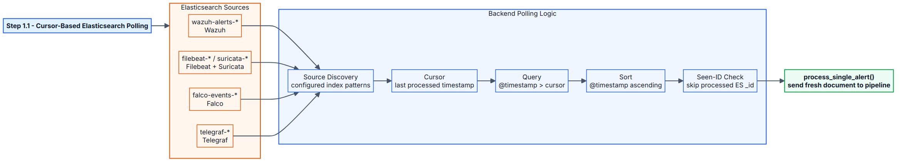

- Per-source cursor stored in Redis (file fallback)
- Query only events newer than the cursor
- Adaptive sleep: fast during bursts, quiet during idle periods
- Each source polled asynchronously

---

# Slide 17 — Normalization

# Raw Document → Clean SOC Alert

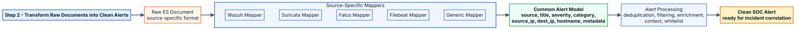

Common fields regardless of source:
- title, severity, source, timestamp
- source/destination IP, hostname, rule name
- dedup_key, asset_id, IOCs
- alert_metadata: geoip, mitre

---

# Slide 18 — Deduplication & Noise Filtering

# Fighting Alert Fatigue

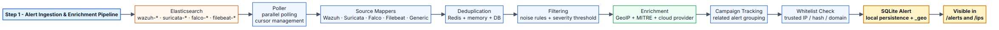

| Stage | Mechanism |
|-------|-----------|
| Deduplication | in-memory → Redis (5 min) → DB check |
| Noise filtering | Sigma rules + auto-learned noise |
| Whitelist | trusted IPs/domains/hosts |

Order matters: dedup → filter → enrich → correlate

---

# Slide 19 — Incident Correlation

# From Alerts to Incidents

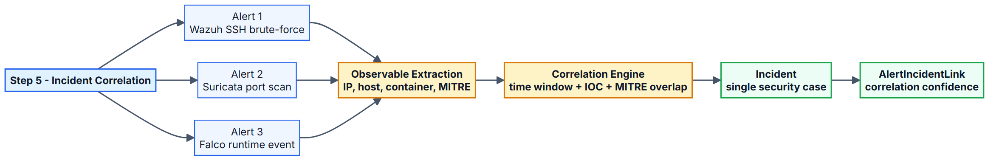

- Group by source IP, destination IP, hostname, user, container
- Time-windowed and indicator-based logic
- 13 attack-type categories: brute force, malware, web attack, cryptomining, container escape, etc.

---

# Slide 20 — Investigation Lifecycle

# Explicit State Machine

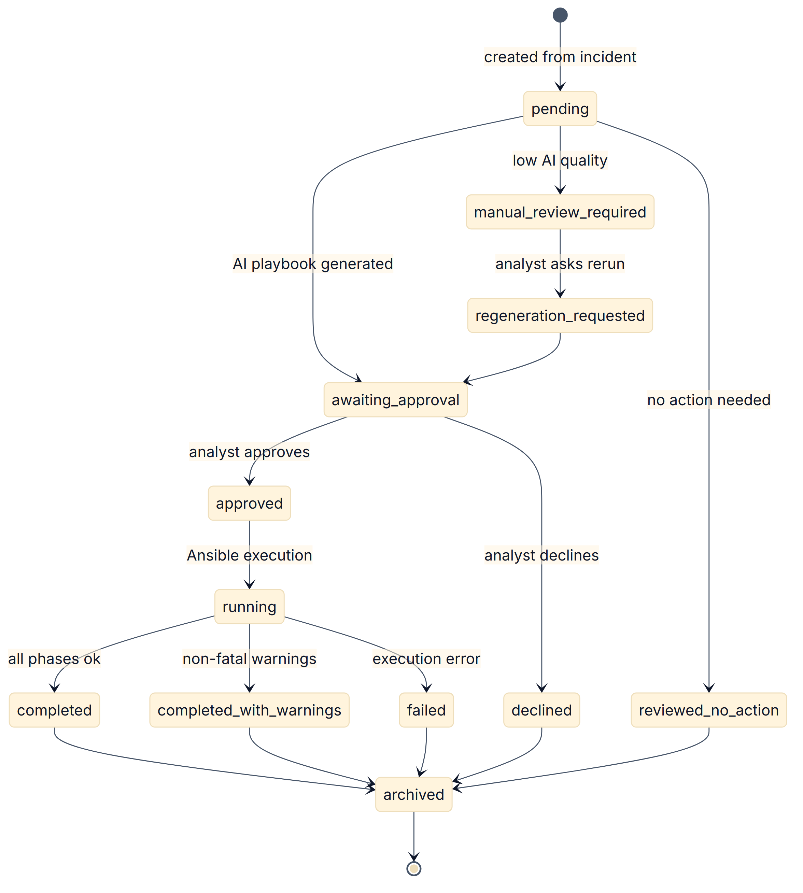

```
pending → awaiting_approval → approved/declined → running
                                  ↓
                         completed/failed → archived
```

Every action is derived from the current state — no ambiguous transitions.

---

# Slide 21 — AI Response Engine

# Context → LLM → Structured Output


- Build structured context: timeline, indicators, MITRE, host info
- Route to configured LLM (local Ollama / cloud fallback)
- Parse structured output: summary, narrative, risk, playbook YAML
- Fallback parsing + rule-based generation on malformed output

---

# Slide 22 — Approval → Execution → Verification → Archive

# Human-in-the-Loop Remediation


1. AI proposes playbook
2. Safety tier + admin-secret gate
3. Analyst approves / edits / declines
4. Ansible executes on scoped asset
5. Verifier re-checks Elasticsearch / remote state
6. Case archived with full audit log

---

# Slide 23 — Performance Monitoring & Remediation

# Metric-Driven Auto-Response


| Metric | Critical | Auto-action |
|--------|----------|-------------|
| CPU | 90% | Restart top process |
| Memory | 85% | Clear caches, restart service |
| Disk | 90% | apt autoremove, vacuum journals |
| Network | 500 MB/s | Audit connections, rate limit |

30-minute cooldown per anomaly type.

---

# Slide 24 — IPS Attack Visualization

# GeoIP-Enabled Situational Awareness

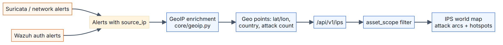

- Map attack sources by country / coordinates
- Per-country breakdown, statistics, filters
- Answers: “Where is this traffic coming from?”

---

# Slide 25 — AI Assistant & AI Operator

# Two AI Interaction Modes

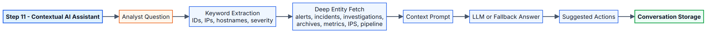

**AI Assistant** — chat-style Q&A about alerts, incidents, infrastructure

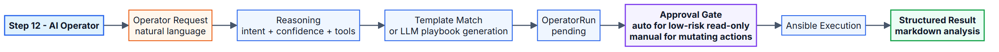

**AI Operator** — guided diagnostic / remediation actions with safety checks

---

# Slide 26 — Frontend Navigation Map

# Dashboard Organization

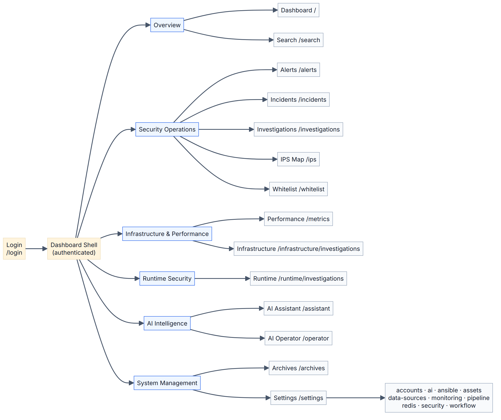

Sidebar groups:
- Overview: dashboard, search
- Security Operations: alerts, incidents, investigations, IPS map, whitelist
- Infrastructure & Performance
- Runtime Security
- AI Intelligence: assistant, operator
- System Management: archives, settings

---

# Slide 27 — Key Dashboards

# Operational Interface

Representative screenshots:
- Dashboard overview
- Alerts list + detail
- Incident timeline
- Investigation AI result
- IPS world map
- Runtime security
- Infrastructure metrics
- AI assistant chat
- Settings / assets

All views respect the selected `asset_id` scope.

---

# Slide 28 — End-to-End SOC Scenario

# Alert → Incident → Investigation → Remediation → Archive

```
Wazuh SSH brute-force alert
        ↓
   Normalized + enriched (GeoIP, MITRE T1110)
        ↓
   Correlated into incident
        ↓
   AI generates summary + Ansible playbook
        ↓
   Analyst approves (admin-secret gate)
        ↓
   Ansible blocks source IP + hardens sshd
        ↓
   Verifier confirms no new brute-force events
        ↓
   Case archived with audit trail
```

---

# Slide 29 — Onboarding a New Server

# From Bare Metal to Scoped Asset

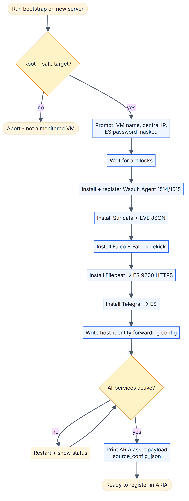

1. Bootstrap script installs Wazuh agent, Filebeat, Falco, Telegraf
2. Registers with central Elasticsearch
3. ARIA creates `MonitoredAsset` record
4. Source validation confirms data arrival

---

# Slide 30 — Asset Payload & Validation

# What ARIA Needs to Know

```json
{
  "name": "dash-linux",
  "host": "192.168.1.20",
  "sources": {
    "wazuh": "wazuh-alerts-4.x-*",
    "suricata": "filebeat-*",
    "falco": "falco-events-*",
    "telegraf": "telegraf-*"
  },
  "ansible": {
    "user": "ansible",
    "ssh_key_ref": "dash-linux-key",
    "become": true
  }
}
```

Validation queries each source index and reports real document counts.

---

# Slide 31 — Production Deployment Workflow

# Staged Rollout

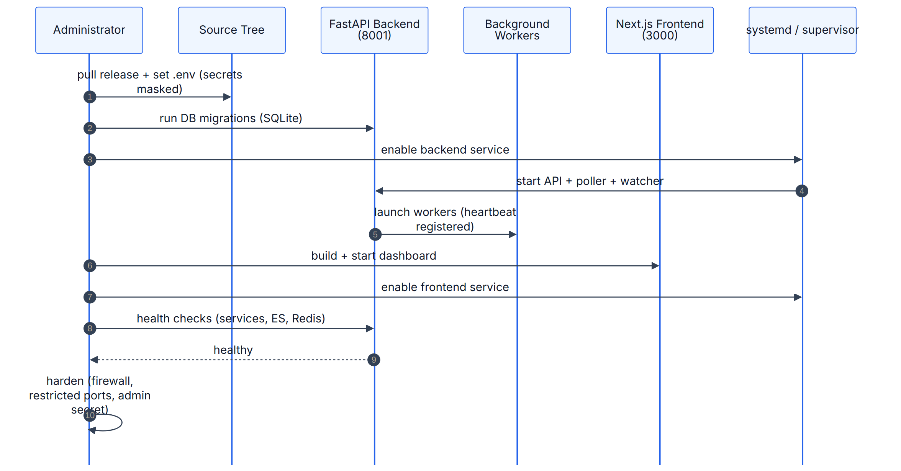

1. Build frontend and backend images
2. Push to registry / copy to host
3. Deploy Redis, API, worker, frontend services
4. Run health checks and API smoke tests
5. Enable pipeline pollers
6. Validate first alert → incident → investigation flow

---

# Slide 32 — Functional Requirements

# What ARIA Must Do

| ID | Requirement |
|----|-------------|
| FR-01 | Poll multi-source alerts from Elasticsearch |
| FR-02 | Normalize alerts into a common model |
| FR-03 | Enrich with GeoIP and MITRE ATT&CK |
| FR-04 | Deduplicate and filter noise |
| FR-05 | Correlate alerts into incidents |
| FR-06 | Generate AI investigations and playbooks |
| FR-07 | Approval workflow with admin-secret gate |
| FR-08 | Execute Ansible playbooks safely |
| FR-09 | Verify fixes and archive cases |
| FR-10 | Multi-server asset scoping |

---

# Slide 33 — Non-Functional Requirements

# Quality Targets

| Category | Target |
|----------|--------|
| Security | Admin-secret gate; secrets never returned; ES/Redis internal |
| Reliability | Background tasks restart without crashing API |
| Performance | Poll latency < 10 s; dashboard load < 2 s |
| Scalability | Single-node SOC; multi-server scope |
| Auditability | Every sensitive transition persisted |
| Maintainability | Clear package boundaries |

---

# Slide 34 — Methodology & Testing

# Agile Iterative, 2-Week Sprints

- **Methodology:** phased iterative with 2-week validation sprints
- **Sprint rhythm:** plan → implement → test → demo → document
- **Test levels:**
  - Unit tests (pytest)
  - Integration tests (API + DB + Redis)
  - Functional tests (end-to-end alert → archive)
  - Security tests (admin-secret bypass attempts)
  - Performance tests (poller throughput)

---

# Slide 35 — Results & Achievements

# What Was Built

| Metric | Value |
|--------|-------|
| Python backend | ~39 K lines |
| TypeScript frontend | ~57 K lines |
| API routes | 16 modules |
| DB models | 13 |
| Backend modules compiled | 146 |
| Automated tests passed | 910 / 910 |
| API root health check | HTTP 200 OK |
| Alerts ingested | 2,577 |
| Incidents created | 202 |
| Investigations | 423 |

**Validation:** backend compiles, API root 200 OK, multi-server activation, admin-secret verification, frontend build success.

---

# Slide 36 — Thank You / Q&A

# Questions?

## **ARIA**
### Adaptive Response Intelligence Automation

**Ghazi Mabrouki**

PFE — ESPRIT University
Huawei Technologies — Tunis, Tunisia

---

*End of Presentation*
