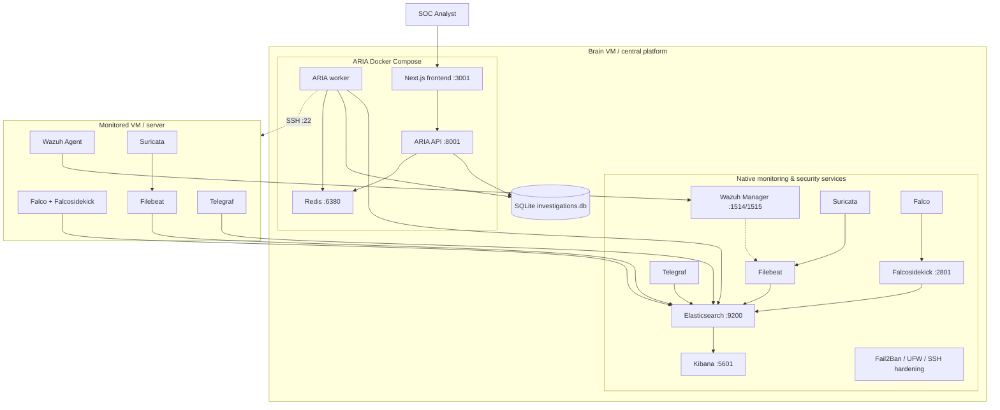
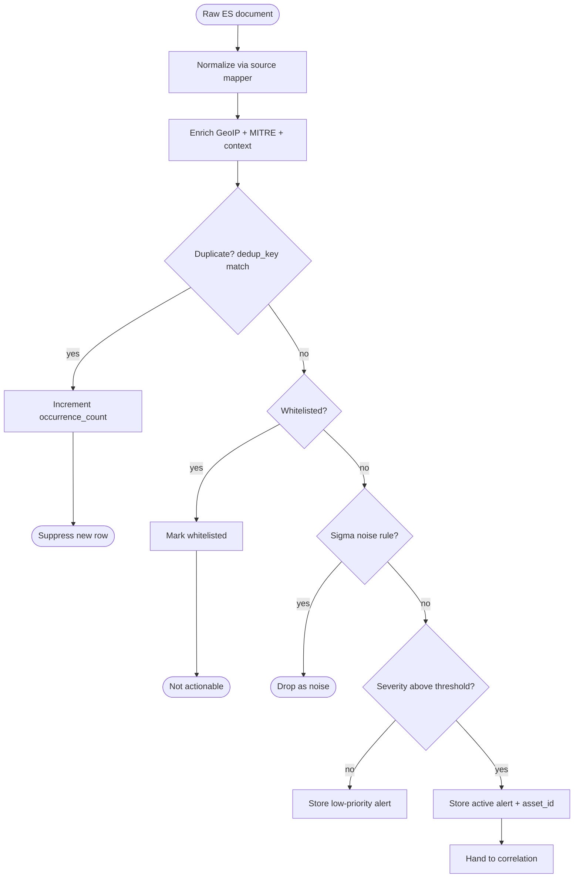

# ARIA Architecture

This document describes the current, confirmed ARIA architecture only. Where historical or reference material conflicts with current source code, current source code takes precedence.

## Deployment roles

### Brain VM / central platform

The Brain VM is the single central host for ARIA. *Confirmed from current source.*

Responsibilities:

- Elasticsearch 7.17.13 (telemetry ingest and query source).
- Kibana (analyst search, rules, dashboards).
- Wazuh Manager (agent events and enrollment).
- Filebeat (ships Brain logs, Wazuh alerts, Suricata EVE to Elasticsearch).
- Suricata (network IDS).
- Falco + Falcosidekick (runtime security events to Elasticsearch).
- Telegraf (host metrics to Elasticsearch).
- Detection rules and host hardening (Fail2Ban, UFW, SSH) where the current scripts support them.
- ARIA Compose stack: Redis, FastAPI, worker, Next.js frontend.
- SQLite operational workflow database and Redis cache/pub-sub state.
- Ansible control-node capability for approved remediation.

### Monitored VM / server

A monitored server runs only selected telemetry producers. *Confirmed from current source.*

Responsibilities:

- Wazuh Agent → central Wazuh Manager.
- Filebeat → Elasticsearch.
- Suricata → local EVE → Filebeat → Elasticsearch.
- Falco → local Falcosidekick → Elasticsearch.
- Telegraf → Elasticsearch.

It does **not** run the ARIA API, ARIA worker, Redis, SQLite, Kibana, Elasticsearch, or Wazuh Manager. *Confirmed from current source.*

### ARIA Compose containers

`aria-application/docker-compose.yml` defines exactly four services. *Confirmed from current source.*

| Service | Image tag (current) | Host port | Purpose |
|---|---|---|---|
| `redis` | `ghaziiii/aria_project:redis-latest` | `6380` → container `6379` | Cache, deduplication, pub-sub, rate-limiting state. |
| `api` | `ghaziiii/aria_project:backend-latest` | `8001` | FastAPI REST/WebSocket backend. |
| `worker` | `ghaziiii/aria_project:worker-latest` | none | Polls Elasticsearch, maps/enriches/deduplicates/correlates alerts, runs investigations, remediation, verification, archive. |
| `frontend` | `ghaziiii/aria_project:frontend-latest` | `3001` → container `3000` | Next.js analyst dashboard. |

### Native central services

These are systemd services installed by `aria-tools-setup/tools/setup_script_telegraf.sh`. *Confirmed from current source.*

| Service | Role |
|---|---|
| `elasticsearch` | Telemetry storage and query engine. |
| `kibana` | Analyst UI and rule management. |
| `wazuh-manager` | HIDS manager receiving agent events. |
| `filebeat` | Log/alert shipper for system logs, Wazuh, Suricata. |
| `suricata` | Network intrusion detection. |
| `falco` / `falco-modern-bpf` / `falco-bpf` / `falco-kmod` | Runtime threat detection. |
| `falcosidekick` | Forwards Falco events to Elasticsearch. |
| `telegraf` | Host metrics shipper. |
| `fail2ban` | Brute-force protection. |

## Component responsibility table

| Component | Technology | Responsibility | Failure impact |
|---|---|---|---|
| Elasticsearch | Native systemd, 7.17.13 | Telemetry ingest and query; verification source. | All ingestion, dashboards, verification, and new alert processing stop. |
| Kibana | Native systemd | Raw search, detection rules, dashboards. | Analyst loses raw SIEM UI; ARIA pipeline may continue. |
| Wazuh Manager | Native systemd, 4.5.4-1 | Agent event collection. | Wazuh host alerts and enrollment stop. |
| Filebeat | Native systemd | Ship logs/alerts to Elasticsearch. | Affected log/network/Wazuh pipelines stop. |
| Suricata | Native systemd | Packet-based IDS. | Network IDS visibility lost for the interface. |
| Falco | Native systemd | Syscall/eBPF runtime detection. | Runtime detections stop. |
| Falcosidekick | Native systemd | Forward Falco to Elasticsearch. | Falco may detect locally but ARIA sees nothing. |
| Telegraf | Native systemd | Host metrics to Elasticsearch. | Metrics investigations stale. |
| Redis | Compose `aria-redis` | Cache, dedup, pub-sub, rate-limit state. | Cache fallbacks are partial; stateful operations degrade. |
| ARIA API | Compose `aria-api` | REST/WebSocket interface. | UI/API unavailable; worker may continue. |
| ARIA worker | Compose `aria-worker` | Poll, map, enrich, deduplicate, correlate, investigate, remediate, verify, archive. | No fresh ingest/correlation/investigation/verification; API reads stale state. |
| ARIA frontend | Compose `aria-frontend` | Next.js dashboard. | Users lose dashboard; backend continues. |
| SQLite | Bind-mounted `./data` | Workflow persistence: alerts, incidents, investigations, approvals, playbook runs. | Single point of operational-state failure. |
| Ansible | Worker/API image | Execute approved playbooks over SSH. | Automated response unavailable; monitoring remains. |
| LLM provider | External or Ollama | AI-assisted analysis/playbook generation. | AI features degrade; rule-based fallback may continue. |

## High-level architecture diagram

*Confirmed from current source.*

## Actual data flow

```mermaid
flowchart LR
    A[Monitored/central agents] --> B[Elasticsearch 7.17]
    B --> C[ARIA worker polls ES indices]
    C --> D[source-specific mapper normalizes alerts]
    D --> E[enrichment GeoIP/MITRE/Sigma/anomaly]
    E --> F[deduplication Redis-first SQLite fallback]
    F --> G[correlation into incidents]
    G --> H[(SQLite alerts/incidents)]
    H --> I[optional LLM investigation]
    I --> J{approval-gated Ansible}
    J --> K[SSH remediation]
    K --> L[Elasticsearch re-query verification]
    L --> M[archive]
    M --> N[FastAPI REST/WebSocket :8001]
    N --> O[Next.js dashboard :3001]
```

*Confirmed from current source.*

## Alert processing pipeline

*Confirmed from current source.*

## Data-store responsibilities

| Store | Role | Evidence |
|---|---|---|
| **Elasticsearch** | Source of telemetry, evidence, and verification queries. | `pipeline/poller/main.py`, `response/fix_verifier.py`. |
| **Redis** | Operational cache, deduplication, forwarder stats, settings reload pub-sub, rate-limit state. | `core/redis.py`, `pipeline/services/dedup.py`, `main.py`. |
| **SQLite** | Workflow state: alerts, incidents, investigations, approvals, playbook runs, fix verifications, archives, assets, audit events. | `response/db.py`, `response/models.py`, `config/settings.py`. |
| **Ansible + SSH** | Approved remediation execution; per-asset `ansible_config_json`. | `response/ansible_exec.py`, `response/models.py`, `api/routes/assets.py`. |

## Confirmed ports and traffic direction

| Port | Direction | Purpose | Exposure guidance |
|---|---|---|---|
| 22/tcp | admin / Brain → hosts | SSH and Ansible | Restrict to trusted admin CIDR. |
| 1514/tcp+udp | monitored VM → Brain | Wazuh agent events | Monitored networks only. |
| 1515/tcp | monitored VM → Brain | Wazuh enrollment | Monitored networks only. |
| 55000/tcp | admin / bootstrap → Brain | Wazuh API | Internal only. |
| 2801/tcp | Falco → same-host Falcosidekick | Runtime event reception | Local flow only. |
| 9200/tcp HTTPS | agents / ARIA → Brain | Elasticsearch ingest/query | Restrict to monitored/Brain networks. |
| 5601/tcp HTTPS | analyst → Brain | Kibana | VPN/analyst CIDR only. |
| 6379/tcp container / 6380 host | API/worker → Redis | Cache/state | Production should bind loopback/internal only. |
| 8001/tcp HTTP | frontend / analyst → API | REST, docs, WebSocket | Place behind authenticated TLS reverse proxy. |
| 3000/tcp container / 3001 host | analyst → frontend | Dashboard | Compose access URL is `http://<brain>:3001`. |
| 11434/tcp | worker → Ollama | Local LLM | Only if Ollama selected; no Compose service. |
| 7687/tcp | none active | Neo4j placeholder | Disabled; no implemented dependency. |

*Confirmed from current source and current architecture map.*

## Current local-first behavior vs. historical OpenSOAR

ARIA's default mode is **local-first**: the worker polls Elasticsearch directly and stores state in local SQLite/Redis. *Confirmed from current source.*

Historical references to **OpenSOAR** appear in legacy code paths (`config/settings.py` with `opensoar_enabled=False`), older service names (`opensoar-backend.service`), and historical documents. External OpenSOAR is **not** a current required topology. Historical/reference material.

## What is not in the current implemented flow

- **Kafka** is not in the currently implemented ARIA flow. There is no broker, topic, producer, consumer, or Compose service. *Confirmed from current source.*
- **Neo4j** is a disabled placeholder configuration (`neo4j_enabled=False` in `config/settings.py`), not an active dependency. Port 7687 has no active service. *Confirmed from current source.*
- **Kubernetes, Terraform, high availability, production SSO, production reverse-proxy/TLS, automated cloud provisioning, and fully tested disaster recovery** are not part of the current implementation. *Not confirmed from repository / operational limitation.*

## Operational limitations and unanswered areas

- Single-node Brain model; no clustering or Elasticsearch HA.
- SQLite is the operational-state single point of failure.
- Mutable `latest` Docker image tags in current Compose.
- No declared canonical monitored-VM bootstrap script; several copies exist.
- Backup/recovery is limited to SQLite maintenance scripts and Redis AOF; full-stack DR is unproven.
- Deleting an ARIA asset removes only the registry record, not agents, Wazuh enrollment, SSH access, ES indices, or credentials.
- Production hardening of TLS, SSH host-key verification, authorization, exposed ports, and secrets handling requires review.
