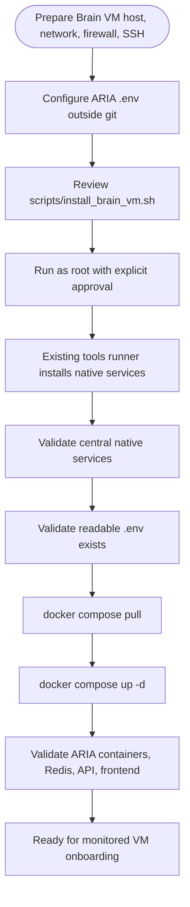

# Brain VM Setup

This guide deploys the ARIA Brain VM: the central host that runs the native monitoring/security services and the ARIA Docker Compose stack.

## ⚠️ Scope and destructive behavior warning

The Brain VM installer runs the existing native-tool setup scripts from `aria-tools-setup/tools/`. Those scripts may, depending on flags and host state:

- `apt-get purge` existing Elasticsearch, Kibana, Filebeat, Suricata, Wazuh Manager, Telegraf, or legacy metric stacks;
- `rm -rf` configuration, data, and log directories;
- regenerate certificates and passwords;
- install, reconfigure, start, stop, or enable systemd services;
- apply UFW rules and SSH hardening (`PermitRootLogin no`, `PasswordAuthentication no`).

Run this only on the intended Brain VM. A mistargeted run can destroy an existing SIEM, lock you out via SSH/UFW changes, or overwrite credentials. *Confirmed from current source.*

## What the Brain VM hosts

- **Native monitoring foundation**: Elasticsearch, Kibana, Wazuh Manager, Filebeat, Suricata, Falco/Falcosidekick, Telegraf, detection rules, Fail2Ban/UFW/SSH hardening.
- **ARIA application containers**: Redis, FastAPI API, ARIA worker, Next.js frontend.
- **Operational state**: SQLite workflow database and Redis AOF volume.

## What is outside this repository's automation

The following must be prepared separately:

- VPC/subnet, security groups, firewall rules, and DNS.
- Reverse proxy and TLS termination.
- Capacity sizing and retention planning.
- Complete backup/recovery strategy.
- SSH key distribution and administrative access.

*Not confirmed from repository.*

## Deployment sequence



## Prerequisites

- **Linux/Debian/Ubuntu assumptions** where source supports them. The current scripts use `apt-get`, `dpkg`, `add-apt-repository`, and `systemd`. *Confirmed from current source.*
- **Root/sudo** access. The installer and the underlying scripts require `root`.
- **Network access** to package repositories (Elastic, Wazuh, Falco, InfluxData, GitHub releases) and the monitored network.
- **Docker and Docker Compose** already available. The wrapper checks for `docker` and `docker compose`; it does not install a separate Docker method.
- **ARIA `.env` prepared** beside the canonical Compose file. The installer requires it to exist and be readable but does not read, source, print, copy, or modify it.

## What `scripts/install_brain_vm.sh` does

The wrapper is intentionally thin. It performs only this sequence:

```text
Existing central tools setup runner
→ validate central native services
→ validate ARIA .env exists
→ docker compose pull
→ docker compose up -d
→ validate ARIA containers, Redis, frontend, and API health
```

It does **not**:

- create cloud resources, DNS, or security groups;
- onboard monitored VMs;
- invoke Ansible;
- register assets;
- enable remediation;
- generate secrets;
- build or push images;
- run migrations, seed scripts, tests, or maintenance jobs;
- restart/repair failed services automatically;
- continue after a mandatory failure.

## Expected central native services

After the tools runner succeeds, the following systemd services should be active:

- `elasticsearch`
- `kibana`
- `filebeat`
- `suricata`
- `wazuh-manager`
- `falcosidekick`
- `telegraf`
- `fail2ban`
- exactly one Falco unit: `falco-modern-bpf`, `falco-bpf`, or `falco-kmod`

*Confirmed from current source.*

## Expected Compose containers

After `docker compose up -d` succeeds, these containers should be running:

- `aria-redis`
- `aria-api`
- `aria-worker`
- `aria-frontend`

*Confirmed from current source.*

## Safe validation commands

```bash
# Native services
systemctl is-active elasticsearch
systemctl is-active kibana
systemctl is-active filebeat
systemctl is-active suricata
systemctl is-active wazuh-manager
systemctl is-active falcosidekick
systemctl is-active telegraf
systemctl is-active fail2ban
systemctl is-active falco-modern-bpf || systemctl is-active falco-bpf || systemctl is-active falco-kmod

# Compose containers
docker compose -f aria-application/docker-compose.yml ps
docker compose -f aria-application/docker-compose.yml ps --services --status running

# Redis
docker compose -f aria-application/docker-compose.yml exec -T redis redis-cli ping

# API health
curl http://127.0.0.1:8001/health

# Frontend
curl -I http://127.0.0.1:3001
```

## Access placeholders

Replace `<BRAIN_VM_IP>` with the actual Brain VM address. Do not expose these endpoints to untrusted networks without TLS and authentication.

| Endpoint | URL |
|---|---|
| Dashboard | `http://<BRAIN_VM_IP>:3001` |
| API health | `http://127.0.0.1:8001/health` |
| API docs | `http://127.0.0.1:8001/docs` |
| Kibana | `https://<BRAIN_VM_IP>:5601` (depending on host/network/TLS configuration) |

## Troubleshooting / log entry points

```bash
# Native service logs
journalctl -u elasticsearch --no-pager -n 200
journalctl -u kibana --no-pager -n 200
journalctl -u wazuh-manager --no-pager -n 200
journalctl -u filebeat --no-pager -n 200
journalctl -u suricata --no-pager -n 200
journalctl -u falcosidekick --no-pager -n 200
journalctl -u telegraf --no-pager -n 200
journalctl -u fail2ban --no-pager -n 200

# Compose logs
docker compose -f aria-application/docker-compose.yml logs --tail=200 api worker redis frontend

# Elasticsearch status (requires credentials; do not show them)
curl -k -u <ELASTICSEARCH_USERNAME> https://127.0.0.1:9200/_cluster/health
```

## Capacity sizing

The project report mentions a demonstrated Huawei Cloud ECS with 64 vCPU and 128 GB RAM. This is **historical project evidence only**, not a documented minimum requirement. Size the Brain VM based on your own retention, EPS, and query load. *Historical/reference material.*
