# SOC Project - Mermaid Diagram Library

All diagrams use a light theme and are intended for insertion into the presentation or report.

## Phase 1 - Security Monitoring Foundation

### Diagram 1 - Global Architecture & Data Flow
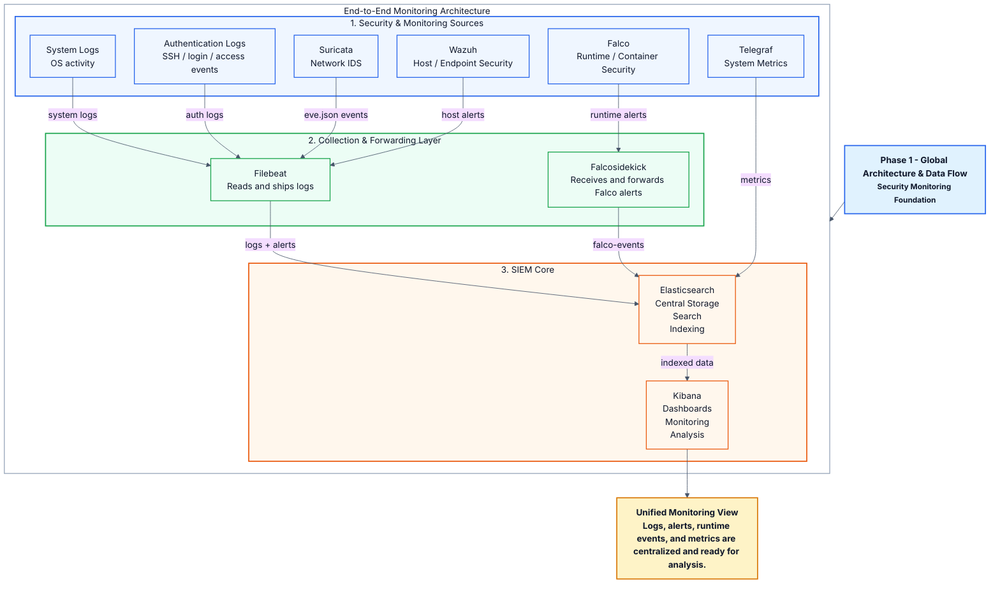

### Diagram 2 - Deployment, Technical Setup & Requirements
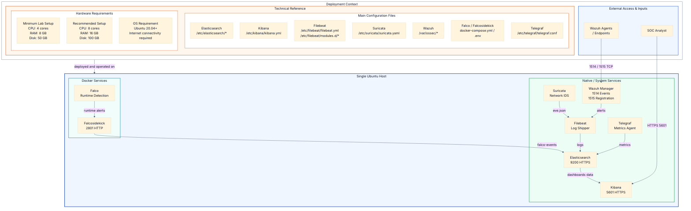

### Diagram 3 - Visibility Layers & Tool Roles
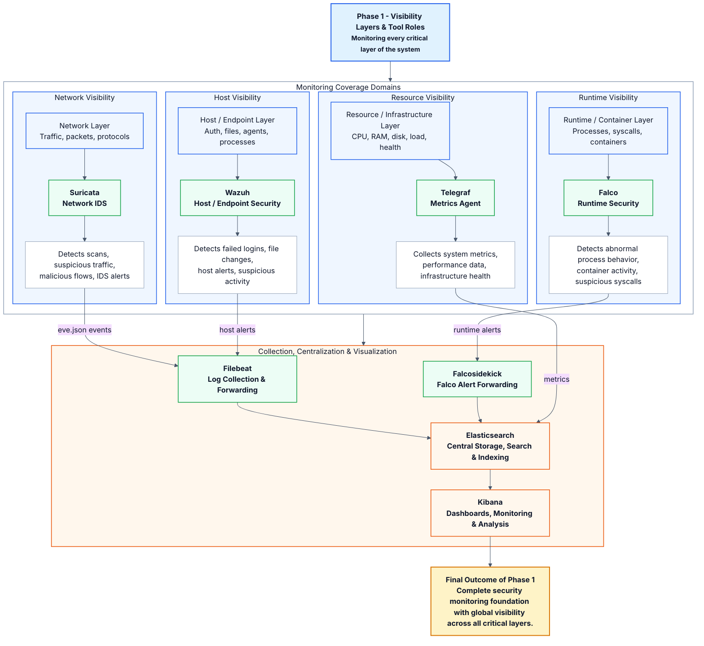

## Phase 2 - Huawei Cloud Infrastructure

### Diagram 4 - Huawei Cloud Infrastructure Foundation
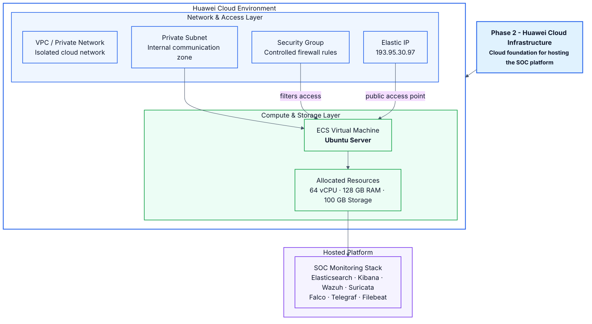

## Phase 3 - Backend Intelligence Layer

### Diagram 5 - Global Phase 3 Backend Intelligence Layer
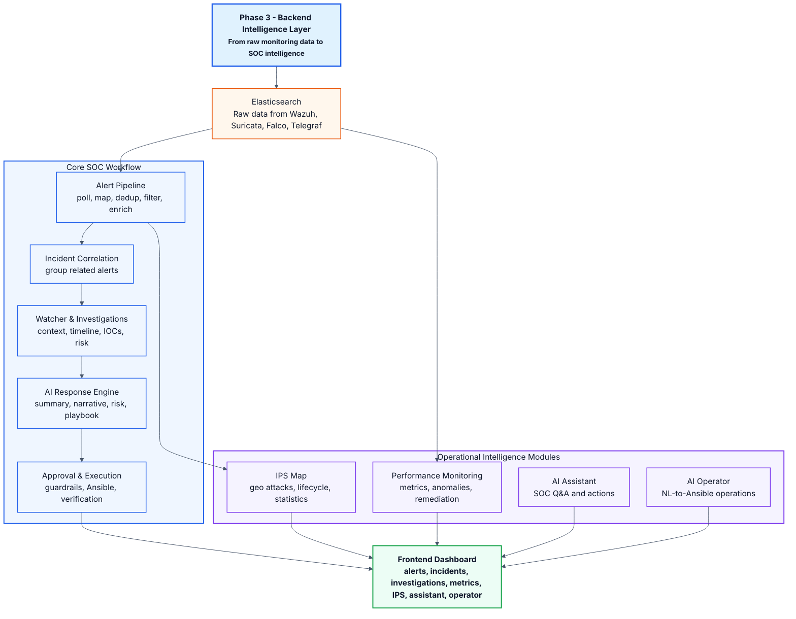

### Diagram 6 - Alert Ingestion & Enrichment Pipeline
```mermaid
%%{init: {
  "theme": "base",
  "themeVariables": {
    "background": "#FFFFFF",
    "primaryTextColor": "#0F172A",
    "lineColor": "#475569",
    "fontFamily": "Inter, Arial"
  },
  "flowchart": {
    "useMaxWidth": true,
    "htmlLabels": true,
    "nodeSpacing": 35,
    "rankSpacing": 45,
    "curve": "basis"
  }
}}%%
flowchart LR
  TITLE["Step 1 - Alert Ingestion & Enrichment Pipeline"]
  ES["Elasticsearch<br/>wazuh-* · suricata-* · falco-* · filebeat-*"]
  POLL["Poller<br/>parallel polling<br/>cursor management"]
  MAP["Source Mappers<br/>Wazuh · Suricata · Falco · Filebeat · Generic"]
  DEDUP["Deduplication<br/>Redis + memory + DB"]
  FILTER["Filtering<br/>noise rules + severity threshold"]
  ENRICH["Enrichment<br/>GeoIP + MITRE + cloud provider"]
  CAMP["Campaign Tracking<br/>related alert grouping"]
  WHITE["Whitelist Check<br/>trusted IP / hash / domain"]
  STORE["SQLite Alert<br/>local persistence + _geo"]
  OUT["Visible in<br/>/alerts and /ips"]
  TITLE --> ES --> POLL --> MAP --> DEDUP --> FILTER --> ENRICH --> CAMP --> WHITE --> STORE --> OUT
  classDef title fill:#E0F2FE,stroke:#2563EB,stroke-width:2px,color:#0F172A,font-weight:bold;
  classDef input fill:#FFF7ED,stroke:#EA580C,stroke-width:1.5px,color:#0F172A;
  classDef process fill:#EFF6FF,stroke:#2563EB,stroke-width:1.5px,color:#0F172A;
  classDef enrich fill:#ECFDF5,stroke:#16A34A,stroke-width:1.5px,color:#0F172A;
  classDef output fill:#FEF3C7,stroke:#D97706,stroke-width:2px,color:#0F172A,font-weight:bold;
  class TITLE title;
  class ES input;
  class POLL,MAP,DEDUP,FILTER,CAMP,WHITE process;
  class ENRICH enrich;
  class STORE,OUT output;
```

### Diagram 7 - Cursor-Based Elasticsearch Polling
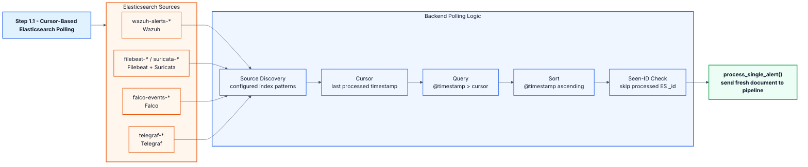

### Diagram 8 - Raw Document to Clean SOC Alert
```mermaid
%%{init: {
  "theme": "base",
  "themeVariables": {
    "background": "#FFFFFF",
    "primaryTextColor": "#0F172A",
    "lineColor": "#475569",
    "fontFamily": "Inter, Arial"
  },
  "flowchart": {
    "useMaxWidth": true,
    "htmlLabels": true,
    "nodeSpacing": 35,
    "rankSpacing": 45,
    "curve": "basis"
  }
}}%%
flowchart LR
  TITLE["Step 2 - Transform Raw Documents into Clean Alerts"]
  RAW["Raw ES Document<br/>source-specific format"]
  subgraph MAPPERS["Source-Specific Mappers"]
    direction TB
    WAZ["Wazuh Mapper"]
    SUR["Suricata Mapper"]
    FAL["Falco Mapper"]
    FB["Filebeat Mapper"]
    GEN["Generic Mapper"]
  end
  COMMON["Common Alert Model<br/>source, title, severity, category,<br/>source_ip, dest_ip, hostname, metadata"]
  PIPE["Alert Processing<br/>deduplication, filtering, enrichment,<br/>context, whitelist"]
  CLEAN["Clean SOC Alert<br/>ready for incident correlation"]
  TITLE --> RAW
  RAW --> MAPPERS
  MAPPERS --> COMMON
  COMMON --> PIPE
  PIPE --> CLEAN
  classDef title fill:#E0F2FE,stroke:#2563EB,stroke-width:2px,color:#0F172A,font-weight:bold;
  classDef raw fill:#FFF7ED,stroke:#EA580C,stroke-width:1.5px,color:#0F172A;
  classDef mapper fill:#EFF6FF,stroke:#2563EB,stroke-width:1.5px,color:#0F172A;
  classDef common fill:#ECFDF5,stroke:#16A34A,stroke-width:1.8px,color:#0F172A,font-weight:bold;
  classDef clean fill:#FEF3C7,stroke:#D97706,stroke-width:2px,color:#0F172A,font-weight:bold;
  class TITLE title;
  class RAW raw;
  class WAZ,SUR,FAL,FB,GEN mapper;
  class COMMON common;
  class PIPE mapper;
  class CLEAN clean;
  style MAPPERS fill:#EFF6FF,stroke:#2563EB,stroke-width:2px,color:#0F172A
```

### Diagram 9 - Enrichment and Context Building
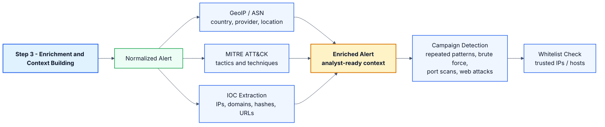

### Diagram 10 - Local Storage and SOC Data Model
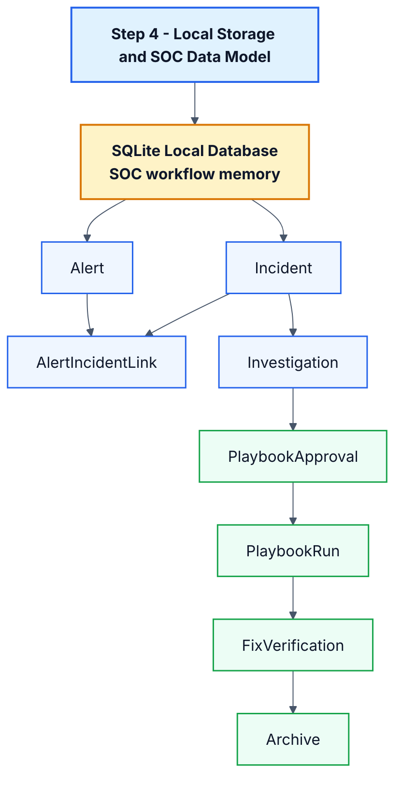

### Diagram 11 - Incident Correlation
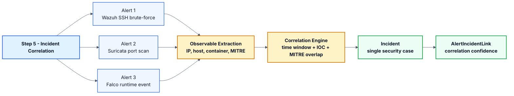

### Diagram 12 - Watcher and Investigation Creation
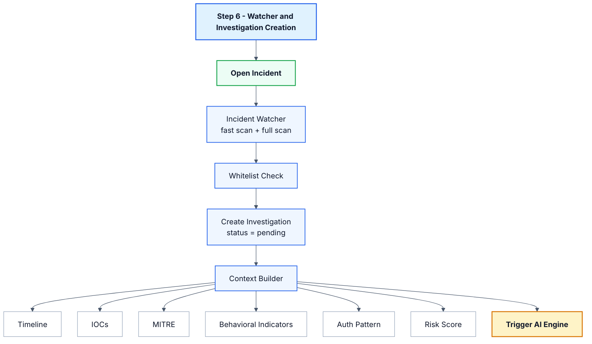

### Diagram 13 - AI Response Engine
```mermaid
%%{init: {
  "theme": "base",
  "themeVariables": {
    "background": "#FFFFFF",
    "primaryTextColor": "#0F172A",
    "lineColor": "#475569",
    "fontFamily": "Inter, Arial"
  },
  "flowchart": {
    "useMaxWidth": true,
    "htmlLabels": true,
    "nodeSpacing": 35,
    "rankSpacing": 45,
    "curve": "basis"
  }
}}%%
flowchart LR
  TITLE["Step 7 - AI Response Engine"]
  CTX["Investigation Context<br/>timeline, IOCs, MITRE, risk"]
  CB["Circuit Breaker"]
  PROMPT["Prompt Builder<br/>strict sections"]
  LLM["LLM Provider<br/>Ollama / Gemini / OpenRouter / NIM"]
  PARSE["Parser<br/>SUMMARY / NARRATIVE / RISK / PLAYBOOK"]
  STORE["Store in Investigation"]
  APPROVE["Auto-Approve Check<br/>or human approval"]
  TITLE --> CTX
  CTX --> CB --> PROMPT --> LLM --> PARSE --> STORE --> APPROVE
  classDef title fill:#E0F2FE,stroke:#2563EB,stroke-width:2px,color:#0F172A,font-weight:bold;
  classDef input fill:#FEF3C7,stroke:#D97706,stroke-width:2px,color:#0F172A,font-weight:bold;
  classDef process fill:#EFF6FF,stroke:#2563EB,stroke-width:1.5px,color:#0F172A;
  classDef final fill:#ECFDF5,stroke:#16A34A,stroke-width:2px,color:#0F172A,font-weight:bold;
  class TITLE title;
  class CTX input;
  class CB,PROMPT,LLM,PARSE,STORE process;
  class APPROVE final;
```

### Diagram 14 - Approval, Execution, Verification and Archive
```mermaid
%%{init: {
  "theme": "base",
  "themeVariables": {
    "background": "#FFFFFF",
    "primaryTextColor": "#0F172A",
    "lineColor": "#475569",
    "fontFamily": "Inter, Arial"
  },
  "flowchart": {
    "useMaxWidth": true,
    "htmlLabels": true,
    "nodeSpacing": 35,
    "rankSpacing": 45,
    "curve": "basis"
  }
}}%%
flowchart LR
  TITLE["Step 8 - Approval, Execution, Verification and Archive"]
  PLAY["Generated Playbook"]
  APPROVAL["Approval Gate<br/>guardrails + confidence + human decision"]
  RUN["Ansible Execution<br/>SSH pre-check + ansible-playbook"]
  VERIFY["Fix Verification<br/>re-check alerts or metrics"]
  ARCHIVE["Archive<br/>preserve case history"]
  UI["Investigation UI"]
  TITLE --> PLAY
  PLAY --> APPROVAL --> RUN --> VERIFY --> ARCHIVE --> UI
  classDef title fill:#E0F2FE,stroke:#2563EB,stroke-width:2px,color:#0F172A,font-weight:bold;
  classDef input fill:#FEF3C7,stroke:#D97706,stroke-width:2px,color:#0F172A,font-weight:bold;
  classDef decision fill:#F5F3FF,stroke:#7C3AED,stroke-width:2px,color:#0F172A,font-weight:bold;
  classDef process fill:#EFF6FF,stroke:#2563EB,stroke-width:1.5px,color:#0F172A;
  classDef final fill:#ECFDF5,stroke:#16A34A,stroke-width:2px,color:#0F172A,font-weight:bold;
  class TITLE title;
  class PLAY input;
  class APPROVAL decision;
  class RUN,VERIFY process;
  class ARCHIVE,UI final;
```

### Diagram 15 - Performance Monitoring and Remediation
```mermaid
%%{init: {
  "theme": "base",
  "themeVariables": {
    "background": "#FFFFFF",
    "primaryTextColor": "#0F172A",
    "lineColor": "#475569",
    "fontFamily": "Inter, Arial"
  },
  "flowchart": {
    "useMaxWidth": true,
    "htmlLabels": true,
    "nodeSpacing": 35,
    "rankSpacing": 45,
    "curve": "basis"
  }
}}%%
flowchart LR
  TITLE["Step 9 - Performance Monitoring and Remediation"]
  TG["Elasticsearch<br/>telegraf-* metrics"]
  POLL["Performance Poller<br/>per-host metrics"]
  REDIS["Redis<br/>current metrics, history, baselines"]
  DETECT["Anomaly Detector<br/>threshold + baseline + cooldown"]
  RCA["Root Cause<br/>top process + playbook type"]
  INV["Performance Investigation"]
  PLAY["Dynamic Playbook"]
  EXEC["Approval + Ansible + Verification"]
  UI["/metrics Dashboard"]
  TITLE --> TG
  TG --> POLL --> REDIS --> DETECT --> RCA --> INV --> PLAY --> EXEC --> UI
  classDef title fill:#E0F2FE,stroke:#2563EB,stroke-width:2px,color:#0F172A,font-weight:bold;
  classDef input fill:#FFF7ED,stroke:#EA580C,stroke-width:1.5px,color:#0F172A;
  classDef process fill:#EFF6FF,stroke:#2563EB,stroke-width:1.5px,color:#0F172A;
  classDef storage fill:#F5F3FF,stroke:#7C3AED,stroke-width:1.5px,color:#0F172A;
  classDef final fill:#ECFDF5,stroke:#16A34A,stroke-width:2px,color:#0F172A,font-weight:bold;
  class TITLE title;
  class TG input;
  class POLL,DETECT,RCA,INV,PLAY,EXEC process;
  class REDIS storage;
  class UI final;
```

### Diagram 16 - IPS Attack Visualization
```mermaid
%%{init: {
  "theme": "base",
  "themeVariables": {
    "background": "#FFFFFF",
    "primaryTextColor": "#0F172A",
    "lineColor": "#475569",
    "fontFamily": "Inter, Arial"
  },
  "flowchart": {
    "useMaxWidth": true,
    "htmlLabels": true,
    "nodeSpacing": 35,
    "rankSpacing": 45,
    "curve": "basis"
  }
}}%%
flowchart LR
  TITLE["Step 10 - IPS Attack Visualization"]
  ALERT["Local SQLite Alerts<br/>+ upstream alerts"]
  DEDUP["Deduplicate<br/>source IP + time window"]
  GEO["GeoIP Resolve<br/>country, city, lat/lon, ASN"]
  CAT["Categorize<br/>brute-force, web attack,<br/>recon, malware, DoS, C2"]
  LIFE["Lifecycle<br/>active / investigating / mitigated / blocked"]
  MAP["/ips World Map<br/>paths, stats, live events"]
  TITLE --> ALERT
  ALERT --> DEDUP --> GEO --> CAT --> LIFE --> MAP
  classDef title fill:#E0F2FE,stroke:#2563EB,stroke-width:2px,color:#0F172A,font-weight:bold;
  classDef input fill:#FFF7ED,stroke:#EA580C,stroke-width:1.5px,color:#0F172A;
  classDef process fill:#EFF6FF,stroke:#2563EB,stroke-width:1.5px,color:#0F172A;
  classDef final fill:#ECFDF5,stroke:#16A34A,stroke-width:2px,color:#0F172A,font-weight:bold;
  class TITLE title;
  class ALERT input;
  class DEDUP,GEO,CAT,LIFE process;
  class MAP final;
```

### Diagram 17 - Contextual AI Assistant
```mermaid
%%{init: {
  "theme": "base",
  "themeVariables": {
    "background": "#FFFFFF",
    "primaryTextColor": "#0F172A",
    "lineColor": "#475569",
    "fontFamily": "Inter, Arial"
  },
  "flowchart": {
    "useMaxWidth": true,
    "htmlLabels": true,
    "nodeSpacing": 35,
    "rankSpacing": 45,
    "curve": "basis"
  }
}}%%
flowchart LR
  TITLE["Step 11 - Contextual AI Assistant"]
  Q["Analyst Question"]
  EXTRACT["Keyword Extraction<br/>IDs, IPs, hostnames, severity"]
  FETCH["Deep Entity Fetch<br/>alerts, incidents, investigations,<br/>archives, metrics, IPS, pipeline"]
  PROMPT["Context Prompt"]
  ANSWER["LLM or Fallback Answer"]
  ACTIONS["Suggested Actions"]
  STORE["Conversation Storage"]
  TITLE --> Q
  Q --> EXTRACT --> FETCH --> PROMPT --> ANSWER --> ACTIONS --> STORE
  classDef title fill:#E0F2FE,stroke:#2563EB,stroke-width:2px,color:#0F172A,font-weight:bold;
  classDef input fill:#FFF7ED,stroke:#EA580C,stroke-width:1.5px,color:#0F172A;
  classDef process fill:#EFF6FF,stroke:#2563EB,stroke-width:1.5px,color:#0F172A;
  classDef final fill:#ECFDF5,stroke:#16A34A,stroke-width:2px,color:#0F172A,font-weight:bold;
  class TITLE title;
  class Q input;
  class EXTRACT,FETCH,PROMPT,ANSWER,ACTIONS process;
  class STORE final;
```

### Diagram 18 - AI Operator
```mermaid
%%{init: {
  "theme": "base",
  "themeVariables": {
    "background": "#FFFFFF",
    "primaryTextColor": "#0F172A",
    "lineColor": "#475569",
    "fontFamily": "Inter, Arial"
  },
  "flowchart": {
    "useMaxWidth": true,
    "htmlLabels": true,
    "nodeSpacing": 35,
    "rankSpacing": 45,
    "curve": "basis"
  }
}}%%
flowchart LR
  TITLE["Step 12 - AI Operator"]
  REQ["Operator Request<br/>natural language"]
  REASON["Reasoning<br/>intent + confidence + tools"]
  TEMPLATE["Template Match<br/>or LLM playbook generation"]
  PENDING["OperatorRun<br/>pending"]
  GATE["Approval Gate<br/>auto for low-risk read-only<br/>manual for mutating actions"]
  EXEC["Ansible Execution"]
  ANALYSIS["Structured Result<br/>markdown analysis"]
  TITLE --> REQ
  REQ --> REASON --> TEMPLATE --> PENDING --> GATE --> EXEC --> ANALYSIS
  classDef title fill:#E0F2FE,stroke:#2563EB,stroke-width:2px,color:#0F172A,font-weight:bold;
  classDef input fill:#FFF7ED,stroke:#EA580C,stroke-width:1.5px,color:#0F172A;
  classDef process fill:#EFF6FF,stroke:#2563EB,stroke-width:1.5px,color:#0F172A;
  classDef decision fill:#F5F3FF,stroke:#7C3AED,stroke-width:2px,color:#0F172A,font-weight:bold;
  classDef final fill:#ECFDF5,stroke:#16A34A,stroke-width:2px,color:#0F172A,font-weight:bold;
  class TITLE title;
  class REQ input;
  class REASON,TEMPLATE,PENDING,EXEC process;
  class GATE decision;
  class ANALYSIS final;
```

